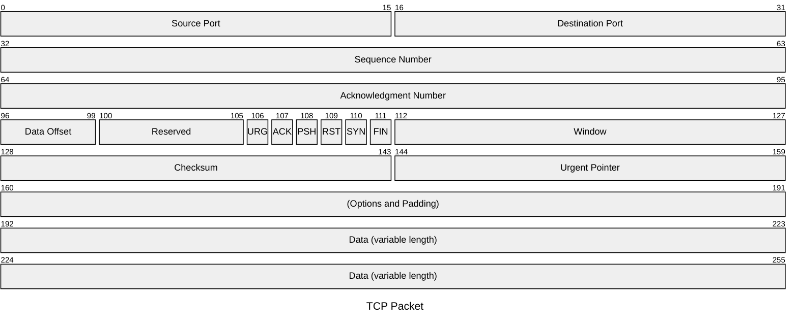
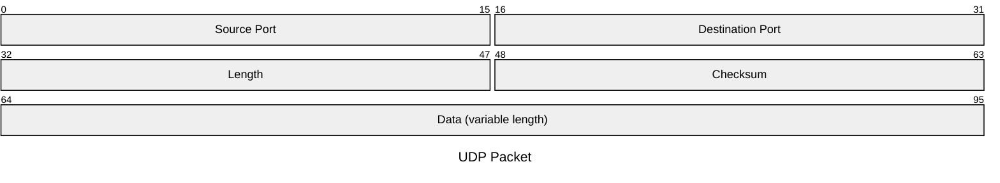
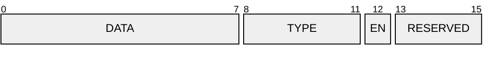
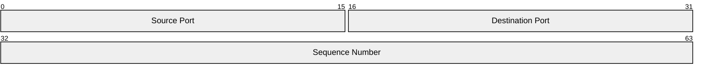

# Packet Diagram (v11.0.0+)

## Introduction

A packet diagram is a visual representation used to illustrate the structure and contents of a network packet. Network packets are the fundamental units of data transferred over a network.

## Usage

This diagram type is particularly useful for developers, network engineers, educators, and students who require a clear and concise way to represent the structure of network packets.

## Syntax

```
packet
start: "Block name" %% Single-bit block
start-end: "Block name" %% Multi-bit blocks
... More Fields ...
```

### Bits Syntax (v11.7.0+)

Using start and end bit counts can be difficult, especially when modifying a design. For this we add a bit count field, which starts from the end of the previous field automagically. Use `+<count>` to set the number of bits, thus:

```
packet
+1: "Block name" %% Single-bit block
+8: "Block name" %% 8-bit block
9-15: "Manually set start and end, it's fine to mix and match"
... More Fields ...
```

## Examples


```mermaid-example
---
title: "TCP Packet"
---
packet
0-15: "Source Port"
16-31: "Destination Port"
32-63: "Sequence Number"
64-95: "Acknowledgment Number"
96-99: "Data Offset"
100-105: "Reserved"
106: "URG"
107: "ACK"
108: "PSH"
109: "RST"
110: "SYN"
111: "FIN"
112-127: "Window"
128-143: "Checksum"
144-159: "Urgent Pointer"
160-191: "(Options and Padding)"
192-255: "Data (variable length)"
```


```mermaid-example
packet
title UDP Packet
+16: "Source Port"
+16: "Destination Port"
32-47: "Length"
48-63: "Checksum"
64-95: "Data (variable length)"
```

## Details of Syntax

- **Ranges**: Each line after the title represents a different field in the packet. The range (e.g., `0-15`) indicates the bit positions in the packet.
- **Field Description**: A brief description of what the field represents, enclosed in quotes.

### Bit Numbering Order (v<MERMAID_RELEASE_VERSION>+)

Rows are numbered from their lowest bit on the left up to their highest bit on the right, which suits network packets. Hardware registers are conventionally drawn the other way round, with the most significant bit on the left and bit 0 on the right. Set `bitOrder: descending` to mirror every row:


```mermaid-example
---
config:
  packet:
    showBits: true
    bitOrder: descending
    bitsPerRow: 16
---
packet
0-7: "DATA"
8-11: "TYPE"
12: "EN"
13-15: "RESERVED"
```

Only the drawing is mirrored. Fields are still declared lowest bit first (`0-7`, never `7-0`) and keep their width, so the same diagram can be switched between the two conventions by changing `bitOrder` alone.

Each row is mirrored on its own, so a packet wider than `bitsPerRow` reads as a stack of words that each run from their highest bit down to their lowest: with the default `bitsPerRow: 32`, the second row runs from bit 63 down to bit 32, not down to bit 0. A row that is not completely filled is padded on the left, keeping its lowest bit flush against the right edge.

## Configuration

Please refer to the [configuration](/config/schema-docs/config-defs-packet-diagram-config.html) guide for details.

<!--

Theme variables are not currently working due to a mermaid bug. The passed values are not being propagated into styles function.

## Theme Variables

| Property         | Description                | Default Value |
| ---------------- | -------------------------- | ------------- |
| byteFontSize     | Font size of the bytes     | '10px'        |
| startByteColor   | Color of the starting byte | 'black'       |
| endByteColor     | Color of the ending byte   | 'black'       |
| labelColor       | Color of the labels        | 'black'       |
| labelFontSize    | Font size of the labels    | '12px'        |
| titleColor       | Color of the title         | 'black'       |
| titleFontSize    | Font size of the title     | '14px'        |
| blockStrokeColor | Color of the block stroke  | 'black'       |
| blockStrokeWidth | Width of the block stroke  | '1'           |
| blockFillColor   | Fill color of the block    | '#efefef'     |

## Example on config and theme


```mermaid-example
---
config:
  packet:
    showBits: true
  themeVariables:
    packet:
      startByteColor: red
---
packet
0-15: "Source Port"
16-31: "Destination Port"
32-63: "Sequence Number"
```

-->
