# Quadrant Chart

> A quadrant chart is a visual representation of data that is divided into four quadrants. It is used to plot data points on a two-dimensional grid, with one variable represented on the x-axis and another variable represented on the y-axis. The quadrants are determined by dividing the chart into four equal parts based on a set of criteria that is specific to the data being analyzed. Quadrant charts are often used to identify patterns and trends in data, and to prioritize actions based on the position of data points within the chart. They are commonly used in business, marketing, and risk management, among other fields.

## Example


## Syntax

```note
If there is no points available in the chart both **axis** text and **quadrant** will be rendered in the center of the respective quadrant.
If there are points **x-axis** labels will rendered from left of the respective quadrant also they will be displayed in bottom of the chart, and **y-axis** lables will be rendered in bottom of the respective quadrant, the quadrant text will render at top of the respective quadrant.
```

```note
For points x and y value min value is 0 and max value is 1.
```

### Title

The title is a short description of the chart and it will always render on top of the chart.

#### Example

```
quadrantChart
    title This is a sample example
```

### x-axis

The x-axis determine what text would be displayed in the x-axis. In x-axis there is two part **left** and **right** you can pass **both** or you can pass only **left**. The statement should start with `x-axis` then the `left axis text` followed by the delimiter `-->` then `right axis text`.

#### Example

1. `x-axis <text> --> <text>` both the left and right axis text will be rendered.
2. `x-axis <text>` only the left axis text will be rendered.

### y-axis

The y-axis determine what text would be displayed in the y-axis. In y-axis there is two part **top** and **bottom** you can pass **both** or you can pass only **bottom**. The statement should start with `y-axis` then the `bottom axis text` followed by the delimiter `-->` then `top axis text`.

#### Example

1. `y-axis <text> --> <text>` both the bottom and top axis text will be rendered.
2. `y-axis <text>` only the bottom axis text will be rendered.

### Quadrants text

The `quadrant-[1,2,3,4]` determine what text would be displayed inside the quadrants.

#### Example

1. `quadrant-1 <text>` determine what text will be rendered inside the top right quadrant.
2. `quadrant-2 <text>` determine what text will be rendered inside the top left quadrant.
3. `quadrant-3 <text>` determine what text will be rendered inside the bottom left quadrant.
4. `quadrant-4 <text>` determine what text will be rendered inside the bottom right quadrant.

### Points

Points are used to plot a circle inside the quadrantChart. The syntax is `<text>: [x, y]` here x and y value is in the range 0 - 1.

#### Example

1. `Point 1: [0.75, 0.80]` here the Point 1 will be drawn in the top right quadrant.
2. `Point 2: [0.35, 0.24]` here the Point 2 will be drawn in the bottom left quadrant.

## Chart Configurations

| Parameter                         | Description                                                                                       | Default value |
| --------------------------------- | ------------------------------------------------------------------------------------------------- | :-----------: |
| chartWidth                        | Width of the chart                                                                                |      500      |
| chartHeight                       | Height of the chart                                                                               |      500      |
| titlePadding                      | Top and Bottom padding of the title                                                               |      10       |
| titleFontSize                     | Title font size                                                                                   |      20       |
| quadrantPadding                   | Padding outside all the quadrants                                                                 |       5       |
| quadrantTextTopPadding            | Quadrant text top padding when text is drawn on top ( not data points are there)                  |       5       |
| quadrantLabelFontSize             | Quadrant text font size                                                                           |      16       |
| quadrantInternalBorderStrokeWidth | Border stroke width inside the quadrants                                                          |       1       |
| quadrantExternalBorderStrokeWidth | Quadrant external border stroke width                                                             |       2       |
| xAxisLabelPadding                 | Top and bottom padding of x-axis text                                                             |       5       |
| xAxisLabelFontSize                | X-axis texts font size                                                                            |      16       |
| xAxisPosition                     | Position of x-axis (top , bottom) if there are points the x-axis will alway be rendered in bottom |     'top'     |
| yAxisLabelPadding                 | Left and Right padding of y-axis text                                                             |       5       |
| yAxisLabelFontSize                | Y-axis texts font size                                                                            |      16       |
| yAxisPosition                     | Position of y-axis (left , right)                                                                 |    'left'     |
| pointTextPadding                  | Padding between point and the below text                                                          |       5       |
| pointLabelFontSize                | Point text font size                                                                              |      12       |
| pointRadius                       | Radius of the point to be drawn                                                                   |       5       |

## Chart Theme Variables

| Parameter                        | Description                             |
| -------------------------------- | --------------------------------------- |
| quadrant1Fill                    | Fill color of the top right quadrant    |
| quadrant2Fill                    | Fill color of the top left quadrant     |
| quadrant3Fill                    | Fill color of the bottom left quadrant  |
| quadrant4Fill                    | Fill color of the bottom right quadrant |
| quadrant1TextFill                | Text color of the top right quadrant    |
| quadrant2TextFill                | Text color of the top left quadrant     |
| quadrant3TextFill                | Text color of the bottom left quadrant  |
| quadrant4TextFill                | Text color of the bottom right quadrant |
| quadrantPointFill                | Points fill color                       |
| quadrantPointTextFill            | Points text color                       |
| quadrantXAxisTextFill            | X-axis text color                       |
| quadrantYAxisTextFill            | Y-axis text color                       |
| quadrantInternalBorderStrokeFill | Quadrants inner border color            |
| quadrantExternalBorderStrokeFill | Quadrants outer border color            |
| quadrantTitleFill                | Title color                             |

## Example on config and theme

```mermaid-example
%%{init: {"quadrantChart": {"chartWidth": 400, "chartHeight": 400}, "themeVariables": {"quadrant1TextFill": "#ff0000"} }}%%
quadrantChart
  x-axis Urgent --> Not Urgent
  y-axis Not Important --> "Important ❤"
  quadrant-1 Plan
  quadrant-2 Do
  quadrant-3 Delegate
  quadrant-4 Delete
```


