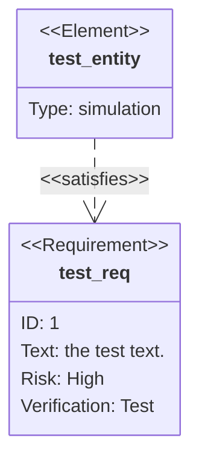
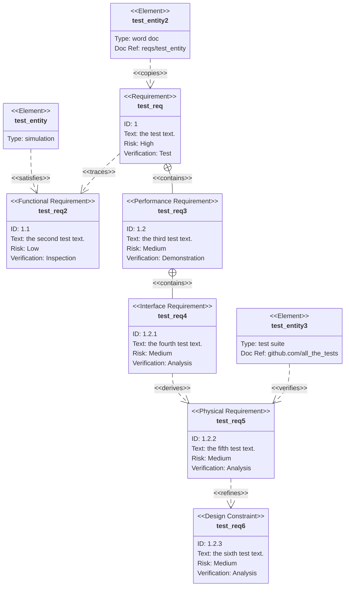

# Requirement Diagram

> A Requirement diagram provides a visualization for requirements and their connections, to each other and other documented elements. The modeling specs follow those defined by SysML v1.6.

Rendering requirements is straightforward.



## Syntax

There are three types of components to a requirement diagram: requirement, element, and relationship.

The grammar for defining each is defined below. Words denoted in angle brackets, such as `<word>`, are enumerated keywords that have options elaborated in a table. `user_defined_...` is use in any place where user input is expected.

An important note on user text: all input can be surrounded in quotes or not. For example, both `Id: "here is an example"` and `Id: here is an example` are both valid. However, users must be careful with unquoted input. The parser will fail if another keyword is detected.

### Requirement

A requirement definition contains a requirement type, name, id, text, risk, and verification method. The syntax follows:

```
<type> user_defined_name {
    id: user_defined_id
    text: user_defined text
    risk: <risk>
    verifymethod: <method>
}
```

Type, risk, and method are enumerations defined in SysML.

| Keyword            | Options                                                                                                                 |
| ------------------ | ----------------------------------------------------------------------------------------------------------------------- |
| Type               | requirement, functionalRequirement, interfaceRequirement, performanceRequirement, physicalRequirement, designConstraint |
| Risk               | Low, Medium, High                                                                                                       |
| VerificationMethod | Analysis, Inspection, Test, Demonstration                                                                               |

### Element

An element definition contains an element name, type, and document reference. These three are all user defined. The element feature is intended to be lightweight but allow requirements to be connected to portions of other documents.

```
element user_defined_name {
    type: user_defined_type
    docref: user_defined_ref
}
```

### Relationship

Relationships are comprised of a source node, destination node, and relationship type.

Each follows the definition format of

```
{name of source} - <type> -> {name of destination}
```

or

```
{name of destination} <- <type> - {name of source}
```

"name of source" and "name of destination" should be names of requirement or element nodes defined elsewhere.

A relationship type can be one of contains, copies, derives, satisfies, verifies, refines, or traces.

Each relationship is labeled in the diagram.

## Larger Example

This example uses all features of the diagram.



<!--- cspell:ignore reqs --->
