# Sequence diagrams

> A Sequence diagram is an interaction diagram that shows how processes operate with one another and in what order.

Mermaid can render sequence diagrams.

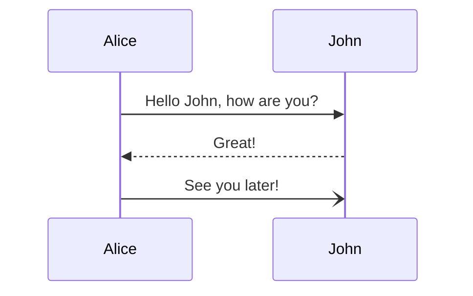
```mermaid-example
sequenceDiagram
    Alice->>John: Hello John, how are you?
    John-->>Alice: Great!
    Alice-)John: See you later!
```

```note
A note on nodes, the word "end" could potentially break the diagram, due to the way that the mermaid language is scripted.

If unavoidable, one must use parentheses(), quotation marks "", or brackets {},[], to enclose the word "end". i.e : (end), [end], {end}.
```

## Syntax

### Participants

The participants can be defined implicitly as in the first example on this page. The participants or actors are
rendered in order of appearance in the diagram source text. Sometimes you might want to show the participants in a
different order than how they appear in the first message. It is possible to specify the actor's order of
appearance by doing the following:

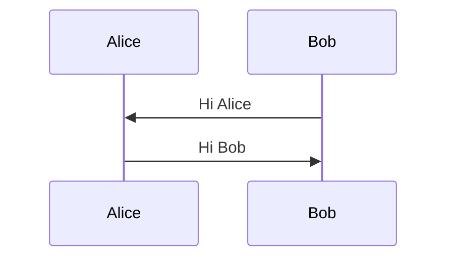
```mermaid-example
sequenceDiagram
    participant Alice
    participant Bob
    Bob->>Alice: Hi Alice
    Alice->>Bob: Hi Bob
```

### Actors

If you specifically want to use the actor symbol instead of a rectangle with text you can do so by using actor statements as per below.

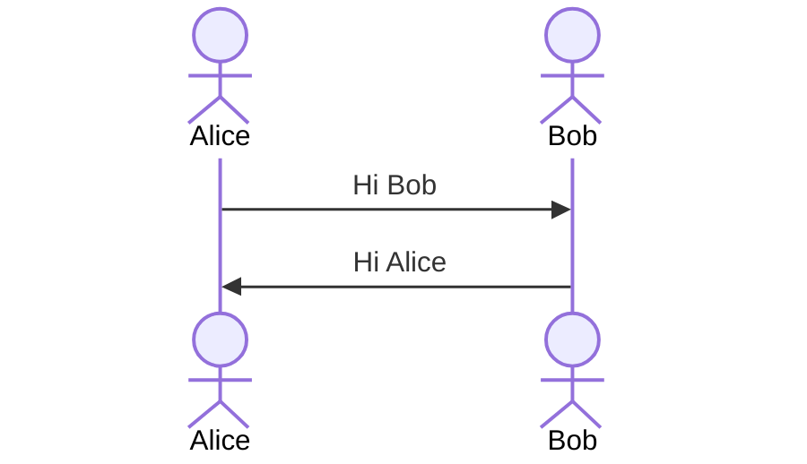
```mermaid-example
sequenceDiagram
    actor Alice
    actor Bob
    Alice->>Bob: Hi Bob
    Bob->>Alice: Hi Alice
```

### Aliases

The actor can have a convenient identifier and a descriptive label.

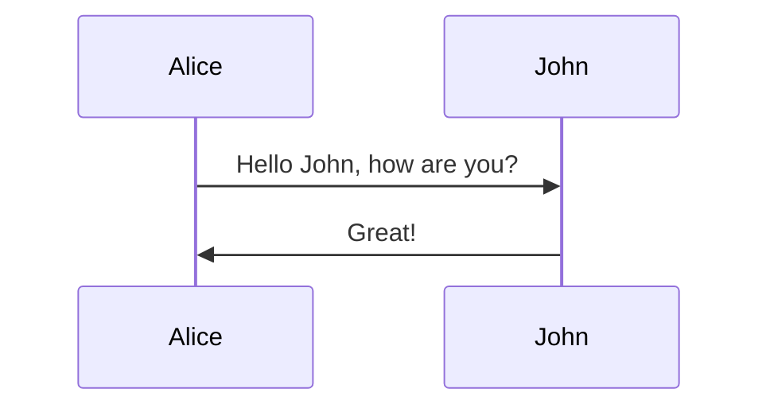
```mermaid-example
sequenceDiagram
    participant A as Alice
    participant J as John
    A->>J: Hello John, how are you?
    J->>A: Great!
```

### Actor Creation and Destruction (v10.3.0+)

It is possible to create and destroy actors by messages. To do so, add a create or destroy directive before the message.

```
create participant B
A --> B: Hello
```

Create directives support actor/participant distinction and aliases. The sender or the recipient of a message can be destroyed but only the recipient can be created.

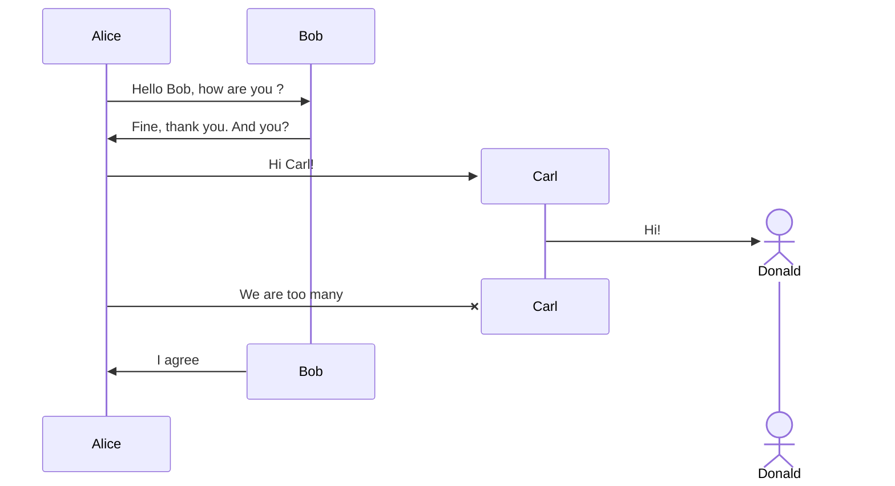
```mermaid-example
sequenceDiagram
    Alice->>Bob: Hello Bob, how are you ?
    Bob->>Alice: Fine, thank you. And you?
    create participant Carl
    Alice->>Carl: Hi Carl!
    create actor D as Donald
    Carl->>D: Hi!
    destroy Carl
    Alice-xCarl: We are too many
    destroy Bob
    Bob->>Alice: I agree
```

#### Unfixable actor/participant creation/deletion error

If an error of the following type occurs when creating or deleting an actor/participant:

> The destroyed participant **participant-name** does not have an associated destroying message after its declaration. Please check the sequence diagram.

And fixing diagram code does not get rid of this error and rendering of all other diagrams results in the same error, then you need to update the mermaid version to (v10.7.0+).

### Grouping / Box

The actor(s) can be grouped in vertical boxes. You can define a color (if not, it will be transparent) and/or a descriptive label using the following notation:

```
box Aqua Group Description
... actors ...
end
box Group without description
... actors ...
end
box rgb(33,66,99)
... actors ...
end
box rgba(33,66,99,0.5)
... actors ...
end
```

```note
If your group name is a color you can force the color to be transparent:
```

```
box transparent Aqua
... actors ...
end
```

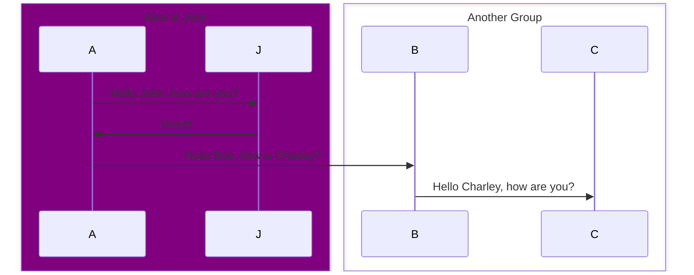
```mermaid-example
    sequenceDiagram
    box Purple Alice & John
    participant A
    participant J
    end
    box Another Group
    participant B
    participant C
    end
    A->>J: Hello John, how are you?
    J->>A: Great!
    A->>B: Hello Bob, how is Charley?
    B->>C: Hello Charley, how are you?
```

## Messages

Messages can be of two displayed either solid or with a dotted line.

```
[Actor][Arrow][Actor]:Message text
```

There are ten types of arrows currently supported:

| Type     | Description                                          |
| -------- | ---------------------------------------------------- |
| `->`     | Solid line without arrow                             |
| `-->`    | Dotted line without arrow                            |
| `->>`    | Solid line with arrowhead                            |
| `-->>`   | Dotted line with arrowhead                           |
| `<<->>`  | Solid line with bidirectional arrowheads (v11.0.0+)  |
| `<<-->>` | Dotted line with bidirectional arrowheads (v11.0.0+) |
| `-x`     | Solid line with a cross at the end                   |
| `--x`    | Dotted line with a cross at the end                  |
| `-)`     | Solid line with an open arrow at the end (async)     |
| `--)`    | Dotted line with a open arrow at the end (async)     |

## Activations

It is possible to activate and deactivate an actor. (de)activation can be dedicated declarations:

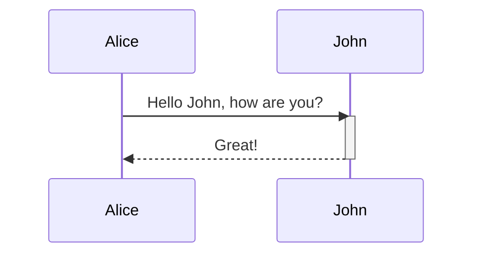
```mermaid-example
sequenceDiagram
    Alice->>John: Hello John, how are you?
    activate John
    John-->>Alice: Great!
    deactivate John
```

There is also a shortcut notation by appending `+`/`-` suffix to the message arrow:

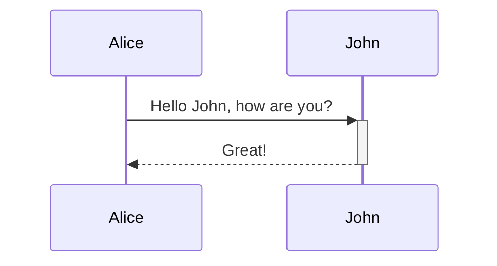
```mermaid-example
sequenceDiagram
    Alice->>+John: Hello John, how are you?
    John-->>-Alice: Great!
```

Activations can be stacked for same actor:

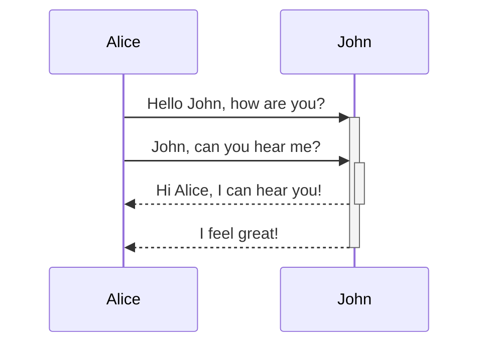
```mermaid-example
sequenceDiagram
    Alice->>+John: Hello John, how are you?
    Alice->>+John: John, can you hear me?
    John-->>-Alice: Hi Alice, I can hear you!
    John-->>-Alice: I feel great!
```

## Notes

It is possible to add notes to a sequence diagram. This is done by the notation
Note [ right of | left of | over ] [Actor]: Text in note content

See the example below:

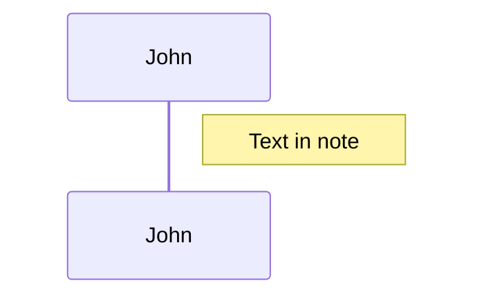
```mermaid-example
sequenceDiagram
    participant John
    Note right of John: Text in note
```

It is also possible to create notes spanning two participants:

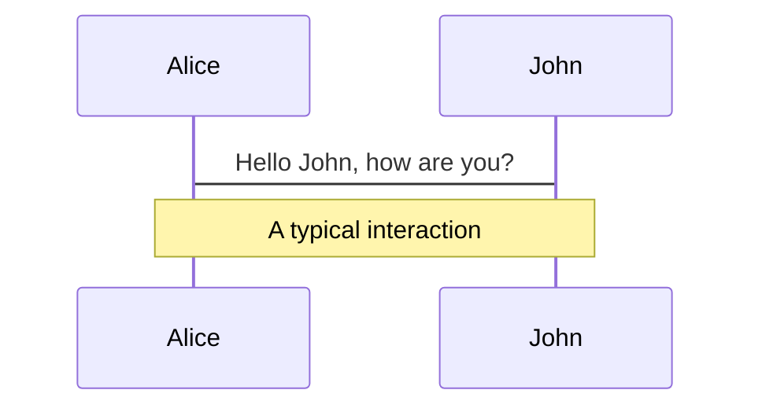
```mermaid-example
sequenceDiagram
    Alice->John: Hello John, how are you?
    Note over Alice,John: A typical interaction
```

## Line breaks

Line break can be added to Note and Message:

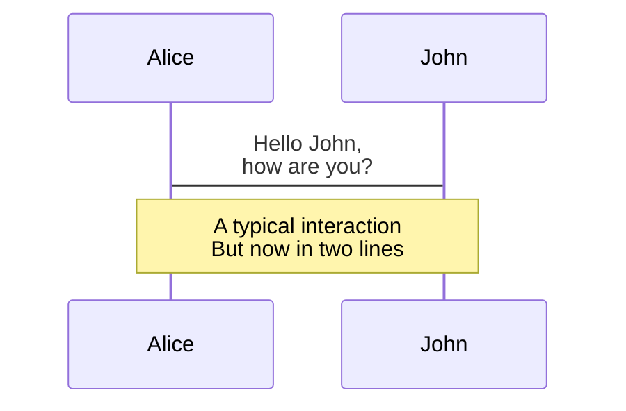
```mermaid-example
sequenceDiagram
    Alice->John: Hello John,<br/>how are you?
    Note over Alice,John: A typical interaction<br/>But now in two lines
```

Line breaks in Actor names requires aliases:

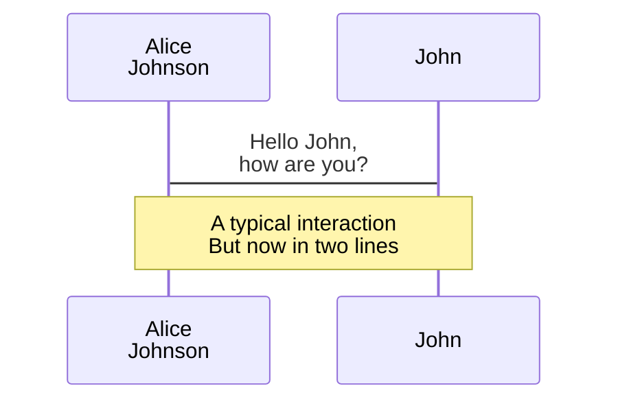
```mermaid-example
sequenceDiagram
    participant Alice as Alice<br/>Johnson
    Alice->John: Hello John,<br/>how are you?
    Note over Alice,John: A typical interaction<br/>But now in two lines
```

## Loops

It is possible to express loops in a sequence diagram. This is done by the notation

```
loop Loop text
... statements ...
end
```

See the example below:

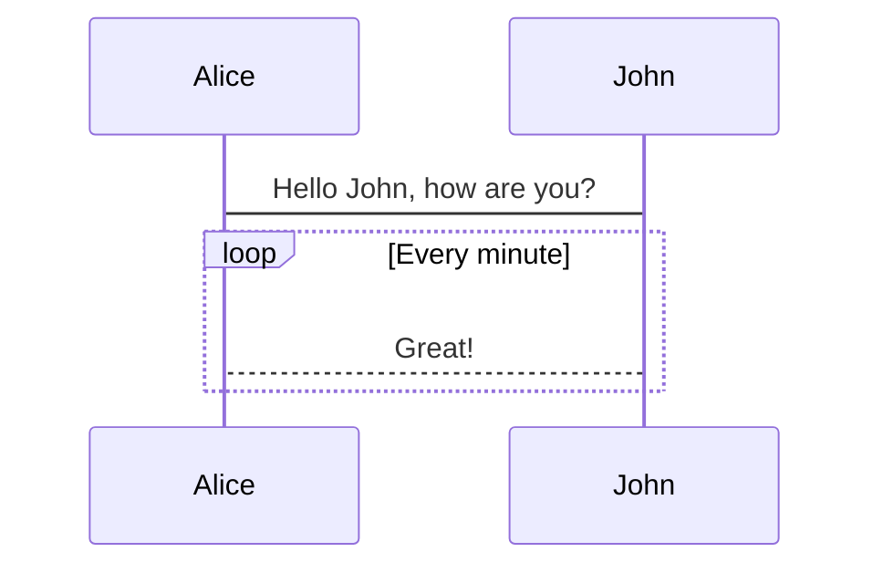
```mermaid-example
sequenceDiagram
    Alice->John: Hello John, how are you?
    loop Every minute
        John-->Alice: Great!
    end
```

## Alt

It is possible to express alternative paths in a sequence diagram. This is done by the notation

```
alt Describing text
... statements ...
else
... statements ...
end
```

or if there is sequence that is optional (if without else).

```
opt Describing text
... statements ...
end
```

See the example below:

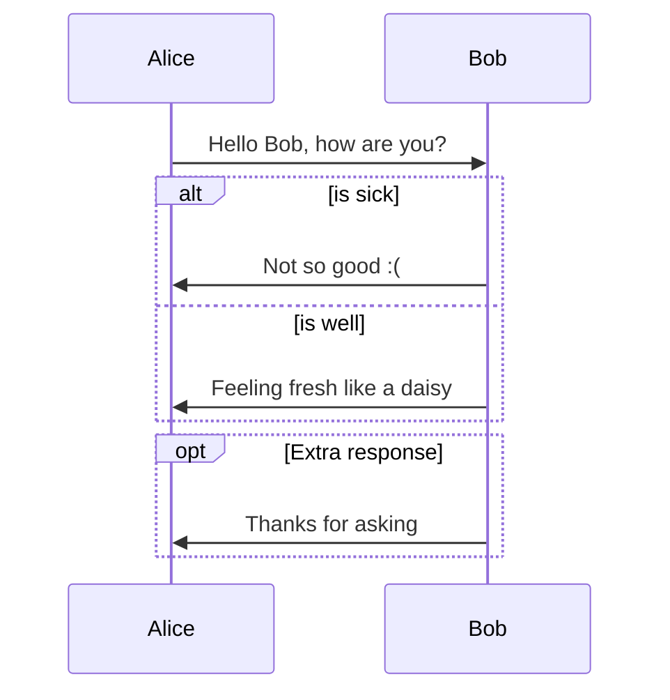
```mermaid-example
sequenceDiagram
    Alice->>Bob: Hello Bob, how are you?
    alt is sick
        Bob->>Alice: Not so good :(
    else is well
        Bob->>Alice: Feeling fresh like a daisy
    end
    opt Extra response
        Bob->>Alice: Thanks for asking
    end
```

## Parallel

It is possible to show actions that are happening in parallel.

This is done by the notation

```
par [Action 1]
... statements ...
and [Action 2]
... statements ...
and [Action N]
... statements ...
end
```

See the example below:

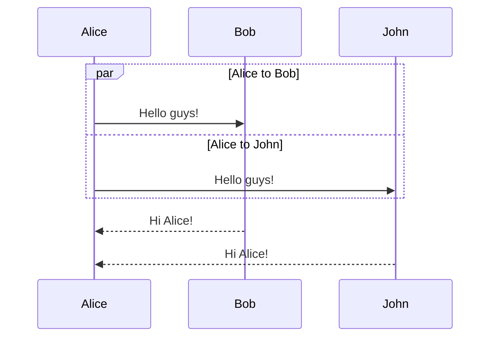
```mermaid-example
sequenceDiagram
    par Alice to Bob
        Alice->>Bob: Hello guys!
    and Alice to John
        Alice->>John: Hello guys!
    end
    Bob-->>Alice: Hi Alice!
    John-->>Alice: Hi Alice!
```

It is also possible to nest parallel blocks.

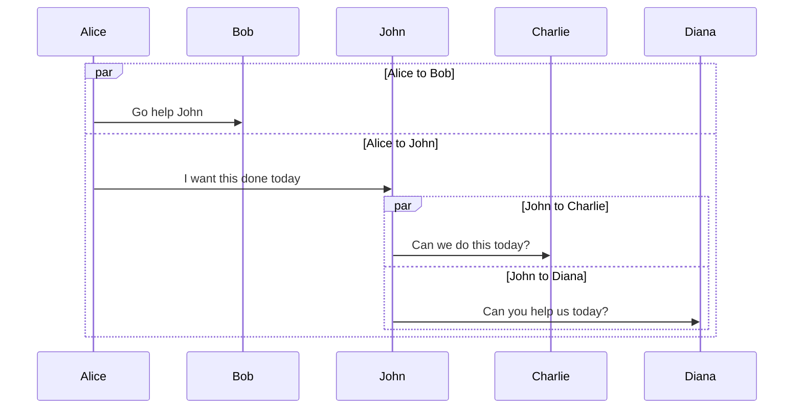
```mermaid-example
sequenceDiagram
    par Alice to Bob
        Alice->>Bob: Go help John
    and Alice to John
        Alice->>John: I want this done today
        par John to Charlie
            John->>Charlie: Can we do this today?
        and John to Diana
            John->>Diana: Can you help us today?
        end
    end
```

## Critical Region

It is possible to show actions that must happen automatically with conditional handling of circumstances.

This is done by the notation

```
critical [Action that must be performed]
... statements ...
option [Circumstance A]
... statements ...
option [Circumstance B]
... statements ...
end
```

See the example below:

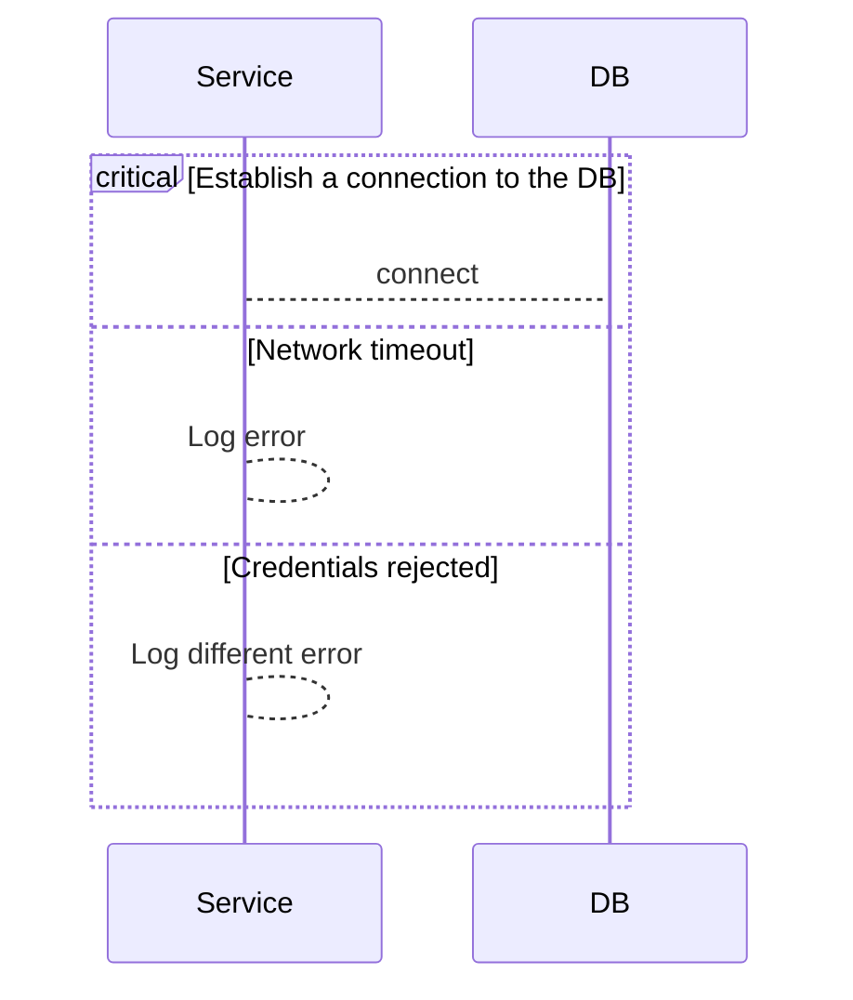
```mermaid-example
sequenceDiagram
    critical Establish a connection to the DB
        Service-->DB: connect
    option Network timeout
        Service-->Service: Log error
    option Credentials rejected
        Service-->Service: Log different error
    end
```

It is also possible to have no options at all

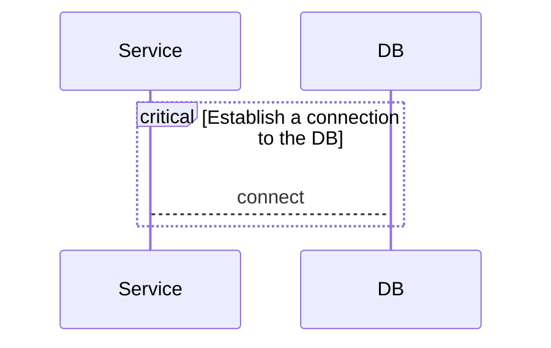
```mermaid-example
sequenceDiagram
    critical Establish a connection to the DB
        Service-->DB: connect
    end
```

This critical block can also be nested, equivalently to the `par` statement as seen above.

## Break

It is possible to indicate a stop of the sequence within the flow (usually used to model exceptions).

This is done by the notation

```
break [something happened]
... statements ...
end
```

See the example below:

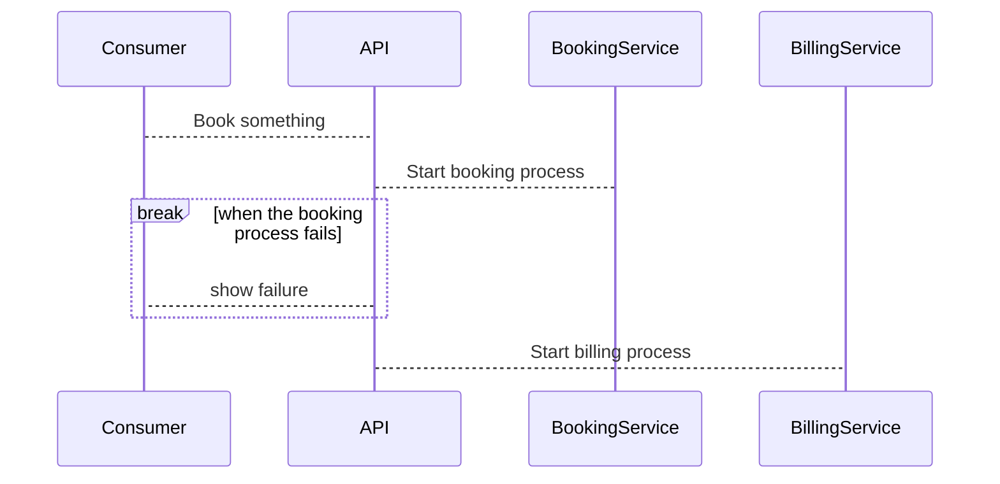
```mermaid-example
sequenceDiagram
    Consumer-->API: Book something
    API-->BookingService: Start booking process
    break when the booking process fails
        API-->Consumer: show failure
    end
    API-->BillingService: Start billing process
```

## Background Highlighting

It is possible to highlight flows by providing colored background rects. This is done by the notation

```
rect COLOR
... content ...
end
```

The colors are defined using rgb and rgba syntax.

```
rect rgb(0, 255, 0)
... content ...
end
```

```
rect rgba(0, 0, 255, .1)
... content ...
end
```

See the examples below:

```mermaid-example
sequenceDiagram
    participant Alice
    participant John

    rect rgb(191, 223, 255)
    note right of Alice: Alice calls John.
    Alice->>+John: Hello John, how are you?
    rect rgb(200, 150, 255)
    Alice->>+John: John, can you hear me?
    John-->>-Alice: Hi Alice, I can hear you!
    end
    John-->>-Alice: I feel great!
    end
    Alice ->>+ John: Did you want to go to the game tonight?
    John -->>- Alice: Yeah! See you there.

```

## Comments

Comments can be entered within a sequence diagram, which will be ignored by the parser. Comments need to be on their own line, and must be prefaced with `%%` (double percent signs). Any text after the start of the comment to the next newline will be treated as a comment, including any diagram syntax

```mermaid
sequenceDiagram
    Alice->>John: Hello John, how are you?
    %% this is a comment
    John-->>Alice: Great!
```

## Entity codes to escape characters

It is possible to escape characters using the syntax exemplified here.

```mermaid-example
sequenceDiagram
    A->>B: I #9829; you!
    B->>A: I #9829; you #infin; times more!
```

Numbers given are base 10, so `#` can be encoded as `#35;`. It is also supported to use HTML character names.

Because semicolons can be used instead of line breaks to define the markup, you need to use `#59;` to include a semicolon in message text.

## sequenceNumbers

It is possible to get a sequence number attached to each arrow in a sequence diagram. This can be configured when adding mermaid to the website as shown below:

```html
<script>
  mermaid.initialize({ sequence: { showSequenceNumbers: true } });
</script>
```

It can also be turned on via the diagram code as in the diagram:

```mermaid-example
sequenceDiagram
    autonumber
    Alice->>John: Hello John, how are you?
    loop HealthCheck
        John->>John: Fight against hypochondria
    end
    Note right of John: Rational thoughts!
    John-->>Alice: Great!
    John->>Bob: How about you?
    Bob-->>John: Jolly good!
```

## Actor Menus

Actors can have popup-menus containing individualized links to external pages. For example, if an actor represented a web service, useful links might include a link to the service health dashboard, repo containing the code for the service, or a wiki page describing the service.

This can be configured by adding one or more link lines with the format:

```
link <actor>: <link-label> @ <link-url>
```

```mermaid
sequenceDiagram
    participant Alice
    participant John
    link Alice: Dashboard @ https://dashboard.contoso.com/alice
    link Alice: Wiki @ https://wiki.contoso.com/alice
    link John: Dashboard @ https://dashboard.contoso.com/john
    link John: Wiki @ https://wiki.contoso.com/john
    Alice->>John: Hello John, how are you?
    John-->>Alice: Great!
    Alice-)John: See you later!
```

#### Advanced Menu Syntax

There is an advanced syntax that relies on JSON formatting. If you are comfortable with JSON format, then this exists as well.

This can be configured by adding the links lines with the format:

```
links <actor>: <json-formatted link-name link-url pairs>
```

An example is below:

```mermaid-example
sequenceDiagram
    participant Alice
    participant John
    links Alice: {"Dashboard": "https://dashboard.contoso.com/alice", "Wiki": "https://wiki.contoso.com/alice"}
    links John: {"Dashboard": "https://dashboard.contoso.com/john", "Wiki": "https://wiki.contoso.com/john"}
    Alice->>John: Hello John, how are you?
    John-->>Alice: Great!
    Alice-)John: See you later!
```

## Styling

Styling of a sequence diagram is done by defining a number of css classes. During rendering these classes are extracted from the file located at src/themes/sequence.scss

### Classes used

| Class          | Description                                                    |
| -------------- | -------------------------------------------------------------- |
| actor          | Styles for the actor box.                                      |
| actor-top      | Styles for the actor figure/ box at the top of the diagram.    |
| actor-bottom   | Styles for the actor figure/ box at the bottom of the diagram. |
| text.actor     | Styles for text of all of the actors.                          |
| text.actor-box | Styles for text of the actor box.                              |
| text.actor-man | Styles for text of the actor figure.                           |
| actor-line     | The vertical line for an actor.                                |
| messageLine0   | Styles for the solid message line.                             |
| messageLine1   | Styles for the dotted message line.                            |
| messageText    | Defines styles for the text on the message arrows.             |
| labelBox       | Defines styles label to left in a loop.                        |
| labelText      | Styles for the text in label for loops.                        |
| loopText       | Styles for the text in the loop box.                           |
| loopLine       | Defines styles for the lines in the loop box.                  |
| note           | Styles for the note box.                                       |
| noteText       | Styles for the text on in the note boxes.                      |

### Sample stylesheet

```css
body {
  background: white;
}

.actor {
  stroke: #ccccff;
  fill: #ececff;
}
text.actor {
  fill: black;
  stroke: none;
  font-family: Helvetica;
}

.actor-line {
  stroke: grey;
}

.messageLine0 {
  stroke-width: 1.5;
  stroke-dasharray: '2 2';
  marker-end: 'url(#arrowhead)';
  stroke: black;
}

.messageLine1 {
  stroke-width: 1.5;
  stroke-dasharray: '2 2';
  stroke: black;
}

#arrowhead {
  fill: black;
}

.messageText {
  fill: black;
  stroke: none;
  font-family: 'trebuchet ms', verdana, arial;
  font-size: 14px;
}

.labelBox {
  stroke: #ccccff;
  fill: #ececff;
}

.labelText {
  fill: black;
  stroke: none;
  font-family: 'trebuchet ms', verdana, arial;
}

.loopText {
  fill: black;
  stroke: none;
  font-family: 'trebuchet ms', verdana, arial;
}

.loopLine {
  stroke-width: 2;
  stroke-dasharray: '2 2';
  marker-end: 'url(#arrowhead)';
  stroke: #ccccff;
}

.note {
  stroke: #decc93;
  fill: #fff5ad;
}

.noteText {
  fill: black;
  stroke: none;
  font-family: 'trebuchet ms', verdana, arial;
  font-size: 14px;
}
```

## Configuration

It is possible to adjust the margins for rendering the sequence diagram.

This is done by defining `mermaid.sequenceConfig` or by the CLI to use a json file with the configuration.
How to use the CLI is described in the [mermaidCLI](../config/mermaidCLI.md) page.
`mermaid.sequenceConfig` can be set to a JSON string with config parameters or the corresponding object.

```javascript
mermaid.sequenceConfig = {
  diagramMarginX: 50,
  diagramMarginY: 10,
  boxTextMargin: 5,
  noteMargin: 10,
  messageMargin: 35,
  mirrorActors: true,
};
```

### Possible configuration parameters:

| Parameter         | Description                                                                                                                                | Default value                  |
| ----------------- | ------------------------------------------------------------------------------------------------------------------------------------------ | ------------------------------ |
| mirrorActors      | Turns on/off the rendering of actors below the diagram as well as above it                                                                 | false                          |
| bottomMarginAdj   | Adjusts how far down the graph ended. Wide borders styles with css could generate unwanted clipping which is why this config param exists. | 1                              |
| actorFontSize     | Sets the font size for the actor's description                                                                                             | 14                             |
| actorFontFamily   | Sets the font family for the actor's description                                                                                           | "Open Sans", sans-serif        |
| actorFontWeight   | Sets the font weight for the actor's description                                                                                           | "Open Sans", sans-serif        |
| noteFontSize      | Sets the font size for actor-attached notes                                                                                                | 14                             |
| noteFontFamily    | Sets the font family for actor-attached notes                                                                                              | "trebuchet ms", verdana, arial |
| noteFontWeight    | Sets the font weight for actor-attached notes                                                                                              | "trebuchet ms", verdana, arial |
| noteAlign         | Sets the text alignment for text in actor-attached notes                                                                                   | center                         |
| messageFontSize   | Sets the font size for actor<->actor messages                                                                                              | 16                             |
| messageFontFamily | Sets the font family for actor<->actor messages                                                                                            | "trebuchet ms", verdana, arial |
| messageFontWeight | Sets the font weight for actor<->actor messages                                                                                            | "trebuchet ms", verdana, arial |
