# State diagrams

> "A state diagram is a type of diagram used in computer science and related fields to describe the behavior of systems.
> State diagrams require that the system described is composed of a finite number of states; sometimes, this is indeed the
> case, while at other times this is a reasonable abstraction." Wikipedia

Mermaid can render state diagrams. The syntax tries to be compliant with the syntax used in plantUml as this will make
it easier for users to share diagrams between mermaid and plantUml.

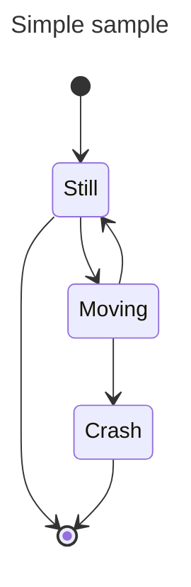

Older renderer:

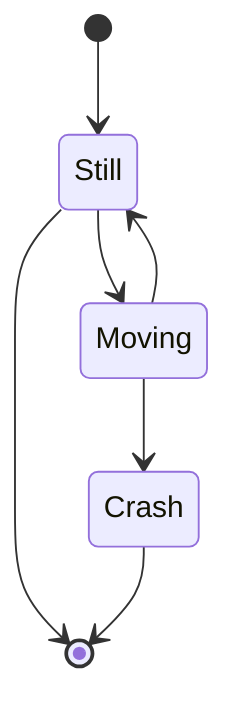

In state diagrams systems are described in terms of _states_ and how one _state_ can change to another _state_ via
a _transition._ The example diagram above shows three states: **Still**, **Moving** and **Crash**. You start in the
**Still** state. From **Still** you can change to the **Moving** state. From **Moving** you can change either back to the **Still** state or to
the **Crash** state. There is no transition from **Still** to **Crash**. (You can't crash if you're still.)

## States

A state can be declared in multiple ways. The simplest way is to define a state with just an id:

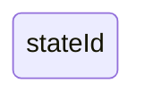

Another way is by using the state keyword with a description as per below:

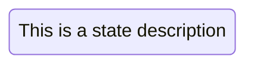

Another way to define a state with a description is to define the state id followed by a colon and the description:


## Transitions

Transitions are path/edges when one state passes into another. This is represented using text arrow, "\-\-\>".

When you define a transition between two states and the states are not already defined, the undefined states are defined
with the id from the transition. You can later add descriptions to states defined this way.

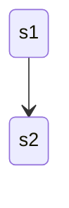

It is possible to add text to a transition to describe what it represents:

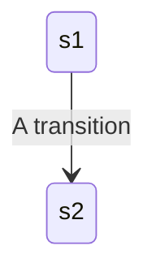

## Start and End

There are two special states indicating the start and stop of the diagram. These are written with the [\*] syntax and
the direction of the transition to it defines it either as a start or a stop state.

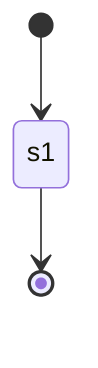

## Composite states

In a real world use of state diagrams you often end up with diagrams that are multidimensional as one state can
have several internal states. These are called composite states in this terminology.

In order to define a composite state you need to use the state keyword followed by an id and the body of the composite
state between \{\}. You can name a composite state on a separate line just like a simple state. See the example below:

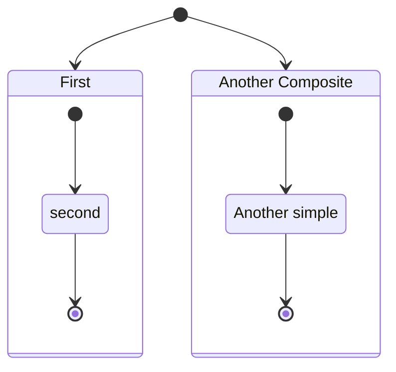

You can do this in several layers:

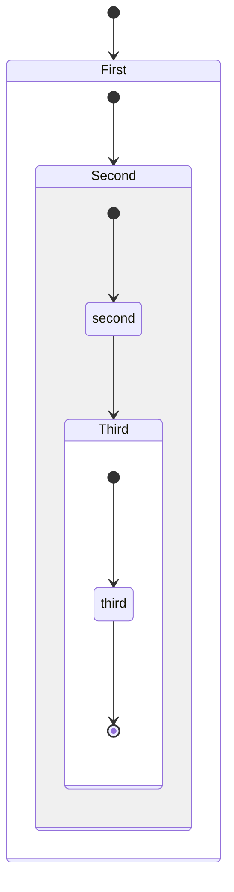

You can also define transitions also between composite states:

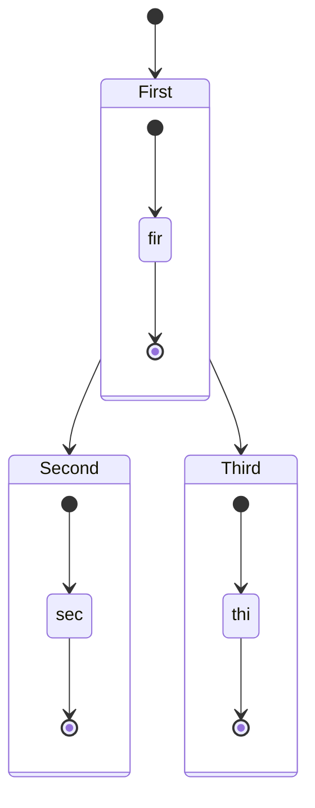

_You can not define transitions between internal states belonging to different composite states_

## Choice

Sometimes you need to model a choice between two or more paths, you can do so using &lt;&lt;choice&gt;&gt;.

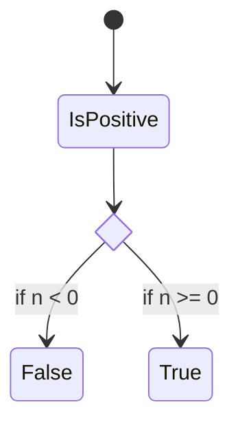

## Forks

It is possible to specify a fork in the diagram using &lt;&lt;fork&gt;&gt; &lt;&lt;join&gt;&gt;.

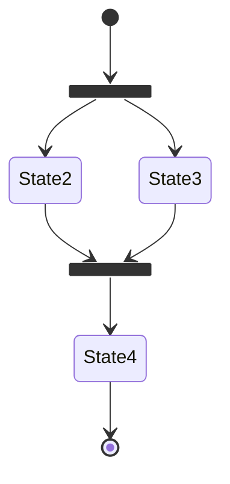

## Notes

Sometimes nothing says it better than a Post-it note. That is also the case in state diagrams.

Here you can choose to put the note to the _right of_ or to the _left of_ a node.

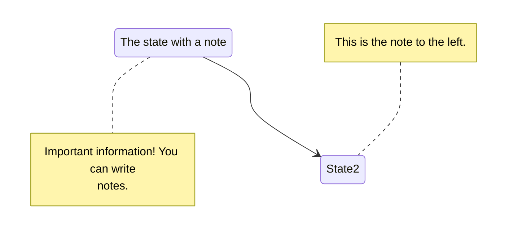

## Concurrency

As in plantUml you can specify concurrency using the -- symbol.

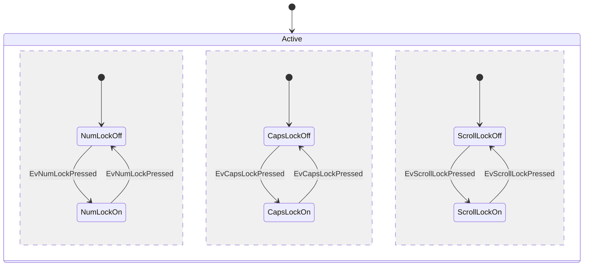

## Setting the direction of the diagram

With state diagrams you can use the direction statement to set the direction which the diagram will render like in this
example.

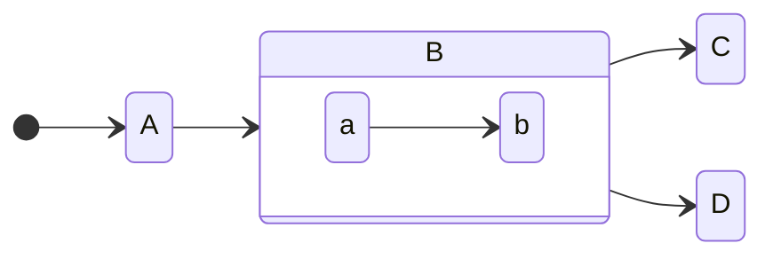

## Comments

Comments can be entered within a state diagram chart, which will be ignored by the parser. Comments need to be on their
own line, and must be prefaced with `%%` (double percent signs). Any text after the start of the comment to the next
newline will be treated as a comment, including any diagram syntax


## Styling with classDefs

As with other diagrams (like flowcharts), you can define a style in the diagram itself and apply that named style to a
state or states in the diagram.

**These are the current limitations with state diagram classDefs:**

1. Cannot be applied to start or end states
2. Cannot be applied to or within composite states

_These are in development and will be available in a future version._

You define a style using the `classDef` keyword, which is short for "class definition" (where "class" means something
like a _CSS class_)
followed by _a name for the style,_
and then one or more _property-value pairs_. Each _property-value pair_ is
a _[valid CSS property name](https://www.w3.org/TR/CSS/#properties)_ followed by a colon (`:`) and then a _value._

Here is an example of a classDef with just one property-value pair:

```txt
classDef movement font-style:italic;
```

where

- the _name_ of the style is `movement`
- the only _property_ is `font-style` and its _value_ is `italic`

If you want to have more than one _property-value pair_ then you put a comma (`,`) between each _property-value pair._

Here is an example with three property-value pairs:

```txt
classDef badBadEvent fill:#f00,color:white,font-weight:bold,stroke-width:2px,stroke:yellow
```

where

- the _name_ of the style is `badBadEvent`
- the first _property_ is `fill` and its _value_ is `#f00`
- the second _property_ is `color` and its _value_ is `white`
- the third _property_ is `font-weight` and its _value_ is `bold`
- the fourth _property_ is `stroke-width` and its _value_ is `2px`
- the fifth _property_ is `stroke` and its _value_ is `yellow`

### Apply classDef styles to states

There are two ways to apply a `classDef` style to a state:

1. use the `class` keyword to apply a classDef style to one or more states in a single statement, or
2. use the `:::` operator to apply a classDef style to a state as it is being used in a transition statement (e.g. with an arrow
   to/from another state)

#### 1. `class` statement

A `class` statement tells Mermaid to apply the named classDef to one or more classes. The form is:

```txt
class [one or more state names, separated by commas] [name of a style defined with classDef]
```

Here is an example applying the `badBadEvent` style to a state named `Crash`:

```txt
class Crash badBadEvent
```

Here is an example applying the `movement` style to the two states `Moving` and `Crash`:

```txt
class Moving, Crash movement
```

Here is a diagram that shows the examples in use. Note that the `Crash` state has two classDef styles applied: `movement`
and `badBadEvent`

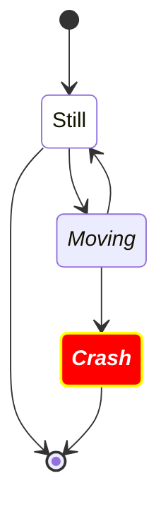

#### 2. `:::` operator to apply a style to a state

You can apply a classDef style to a state using the `:::` (three colons) operator. The syntax is

```txt
[state]:::[style name]
```

You can use this in a diagram within a statement using a class. This includes the start and end states. For example:


## Spaces in state names

Spaces can be added to a state by first defining the state with an id and then referencing the id later.

In the following example there is a state with the id **yswsii** and description **Your state with spaces in it**.
After it has been defined, **yswsii** is used in the diagram in the first transition (`[*] --> yswsii`)
and also in the transition to **YetAnotherState** (`yswsii --> YetAnotherState`).
(**yswsii** has been styled so that it is different from the other states.)

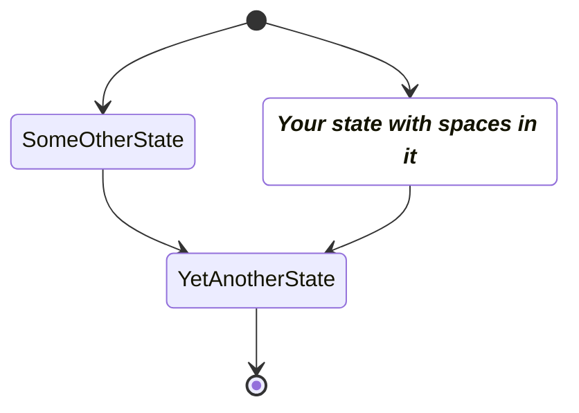

<!--- cspell:ignore yswsii --->
