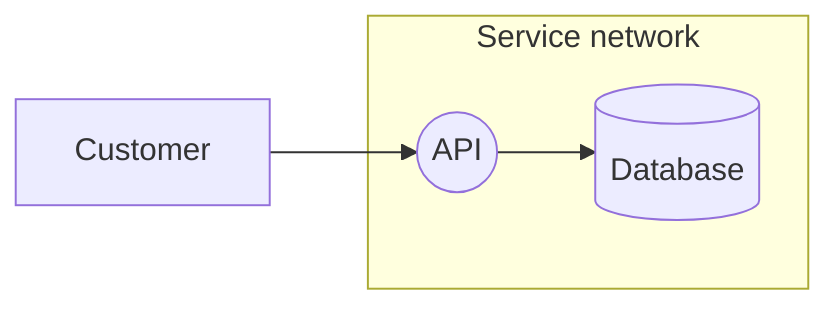

# Threat modeling (experimental PoC)

This extension annotates **ordinary Mermaid flowcharts** with a versioned, structured threat model. It does not introduce a second diagram language or turn Mermaid into an AI service. Human reviewers and agents edit the same `.mmd` document; the graph remains the architecture, and YAML frontmatter holds security semantics and findings.

This approach addresses [issue #5895](https://github.com/mermaid-js/mermaid/issues/5895) without requiring existing flowcharts to be rewritten. OWASP Threat Dragon informs the process/store/actor/flow/boundary vocabulary. It is not a Threat Dragon file-format implementation.

## Try it

From the repository root, with Node and pnpm installed:

```sh
pnpm install
pnpm dev:vite
```

Open **http://localhost:9000/threat-model.html**. The demo loads `demos/threat-model.mmd`. Edit the source, select **Validate & render**, and export Mermaid, SVG, or model JSON. Everything runs locally in the browser; no external AI provider is contacted. This is a source-development demo, not a standalone published editor.

## Minimal example



An unmodified Mermaid build will render the underlying flowchart but **will not validate or display these annotations**. Use this fork for security review. Existing diagrams with no `threatModel` continue to behave normally.

### Linking security semantics to architecture

- `process`, `store`, and `actor` elements reference existing **node IDs**, not labels.
- `flow` elements reference **explicit edge IDs**: `API query@--> DB`. Generated edge IDs are rejected because reordering edges must not silently retarget threats.
- `boundary` elements reference **subgraph IDs**. Nest subgraphs for nested trust zones.
- IDs use letters, digits, underscores and hyphens, starting with a letter or underscore. Preserve them across edits.
- Annotation is incremental: unannotated nodes remain visible. Annotation coverage is **not** proof of threat-model completeness.
- Shape choice stays under the author's control: circles for processes, cylinders for stores, rectangles for actors. Shapes alone do not imply security semantics.

Threat targets get ID badges, tooltips, and severity outlines. Boundaries receive dashed outlines. A visible register contains threat descriptions, severity/status, targets, STRIDE category, risk score, decisions, mitigations, tasks, and evidence. The highest unresolved severity determines an element's outline; resolved/excluded findings remain in the register and source rather than disappearing.

## Version 1 data contract

The executable, strict contract and exported TypeScript interfaces are in `src/threat-model/model.ts`. Unknown keys, duplicate IDs within collections, invalid enums, and dangling references are errors. Lists are limited to 1,000 entries and individual text fields to 10,000 characters.

Required root fields: `version: 1`, `id`, `state`, `elements`, `threats`. All other root fields are optional so a team can start with an existing diagram and refine it during review.

| Vision output                         | Fields                                                                                                   |
| ------------------------------------- | -------------------------------------------------------------------------------------------------------- |
| Identification / ownership            | `id`, `title`, `identification.{codastreProject,codastreService,yapfTicket,securityReviewTicket,owners}` |
| Service notes / context               | `context[]: {id,description,source?}`; `notes[]`                                                         |
| Base and dependency models            | `dependencies[]: {model,description}` (external model references)                                        |
| Components, stores, flows, boundaries | `elements[]: {id,kind,description?,assets?,actor?,entryPoint?}` plus the flowchart topology              |
| Data assets                           | `assets[]: {id,description,classification?}`; referenced by element `assets[]`                           |
| Scope                                 | `assumptions[]`                                                                                          |
| Threat actors                         | `actors[]: {id,description,intent?,access?}`; referenced by element `actor` and threat `actors[]`        |
| Threats and candidates                | `threats[]`, including `candidate` and `excluded` findings                                               |
| History                               | `changelog[]: {date,author,description}` (quote dates in YAML)                                           |

Each threat requires:

- `id`, `title`, `description`, and nonempty `targets[]` referencing annotated elements.
- `severity`: `critical`, `high`, `medium`, `low`, or `info`.
- `status`: `candidate`, `open`, `mitigated`, `accepted`, `transferred`, or `excluded`.

Optional threat fields:

- `category`: `spoofing`, `tampering`, `repudiation`, `information-disclosure`, `denial-of-service`, or `elevation-of-privilege` (STRIDE).
- `framework`: another analysis/scoring framework name, if useful.
- `score: {value,method,rationale}`: a finite non-negative value with an explicit scoring method; no universal scale is assumed.
- `actors[]` and `context[]`: references to model actor/context IDs.
- `decision`, `mitigation`: human-readable rationale and action.
- `tickets[]`, `evidence[]`: reference strings, such as Jira URLs or code paths with revisions/line numbers. They are displayed as inert text, never executable links.

`mitigated` requires both `mitigation` and nonempty `evidence`. `accepted`, `transferred`, and `excluded` require a decision rationale. High/critical threats cannot be marked `accepted`; record effective mitigation instead. A ticket being closed is not evidence by itself.

Model states are `draft`, `actual`, `stale`, and `absent`. They are explicitly authored, not automatically inferred from rendering or an empty threat list. The register warns about non-actual models and unresolved high/critical findings (including transferred risks and candidates). **This is advisory: Mermaid neither blocks deployment nor verifies evidence or approval.**

## Human and agent workflow

1. Preserve the existing flowchart. Assign stable IDs to important edges and subgraphs.
2. Annotate assets, entry points, actors, trust boundaries and assumptions. Link design/context sources and dependency models.
3. Add broad threat candidates, each with explicit targets. Agents can generate YAML; reviewers can edit it live in the demo.
4. Review candidates, severity and mitigations. Retain rejected candidates as `excluded` with rationale. Keep already-mitigated scenarios too.
5. Add mitigation tasks/evidence. Agree on the model with developers and Security; only then explicitly mark it `actual`.
6. Commit the `.mmd` and review its diff. When code, context or dependencies change, mark it `stale` and revise the model.

Git history, reviews, and explicit changelog entries provide traceability for this PoC. Agents should not overwrite human dispositions merely because findings recur.

## Machine-readable API

Both public API calls return the validated model when present:

```js
const parsed = await mermaid.parse(source);
console.log(parsed.threatModel); // undefined for ordinary diagrams

const { svg, threatModel } = await mermaid.render('security-review', source);
const json = JSON.stringify(threatModel, null, 2);
```

`mermaid.parse(source, { suppressErrors: true })` returns `false` for invalid annotations or references, just as for invalid diagram syntax. Model JSON preserves context, dependencies, history, and other metadata even when not all fields are printed in the visual register. The `.mmd` remains the source of truth; SVG is a presentation artifact, not a lossless model serialization.

## Scope and limitations

- Only ordinary `flowchart`/`graph` using the unified (`flowchart-v2`) renderer is supported. Unsupported diagram types fail explicitly when annotations are supplied. Convert sequence/class/etc. diagrams to a flowchart for this PoC; automatic conversion is not implemented.
- This is a source editor with a rendered preview, not a drag-and-drop canvas or concurrent collaboration server.
- No LLM integration, automatic threat inference, context ingestion, dependency propagation, Codastre inventory coverage, Jira synchronization, evidence verification, or CI/CD enforcement is implemented.
- Dependencies link external/nested models; the PoC does not load or recursively analyze them.
- Large models should be split into linked diagrams. The always-visible register deliberately favors inspectability over a compact dashboard.
- Collapsed subgraphs can hide annotated shapes; their threats remain in the register.
- Human review is essential. Successful parsing, no blockers, or no recorded threats must never be interpreted as proof of security.

## Tests

```sh
pnpm exec vitest run packages/mermaid/src/threat-model packages/mermaid/src/diagram-api/frontmatter.spec.ts
```

Tests cover schema validation, reference integrity, decisions/evidence, public parsing and non-leakage, safe SVG text rendering, severity precedence, and ordinary frontmatter compatibility.
