# Timeline Diagram

> Timeline: This is an experimental diagram for now. The syntax and properties can change in future releases. The syntax is stable except for the icon integration which is the experimental part.

"A timeline is a type of diagram used to illustrate a chronology of events, dates, or periods of time. It is usually presented graphically to indicate the passing of time, and it is usually organized chronologically. A basic timeline presents a list of events in chronological order, usually using dates as markers. A timeline can also be used to show the relationship between events, such as the relationship between the events of a person's life" [(Wikipedia)](https://en.wikipedia.org/wiki/Timeline).

### An example of a timeline

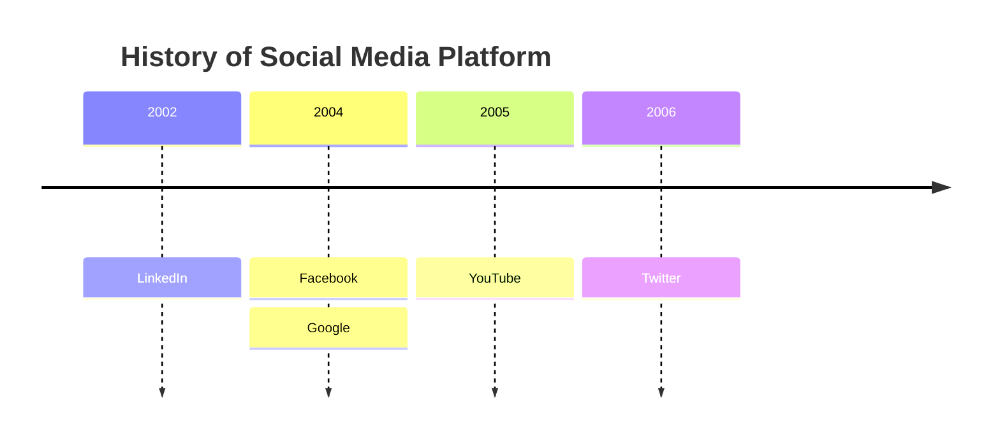

## Syntax

The syntax for creating Timeline diagram is simple. You always start with the `timeline` keyword to let mermaid know that you want to create a timeline diagram.

After that there is a possibility to add a title to the timeline. This is done by adding a line with the keyword `title` followed by the title text.

Then you add the timeline data, where you always start with a time period, followed by a colon and then the text for the event. Optionally you can add a second colon and then the text for the event. So, you can have one or more events per time period.

```json
{time period} : {event}
```

or

```json
{time period} : {event} : {event}
```

or

```json
{time period} : {event}
              : {event}
              : {event}
```

**NOTE**: Both time period and event are simple text, and not limited to numbers.

Let us look at the syntax for the example above.


In this way we can use a text outline to generate a timeline diagram.
The sequence of time period and events is important, as it will be used to draw the timeline. The first time period will be placed at the left side of the timeline, and the last time period will be placed at the right side of the timeline.

Similarly, the first event will be placed at the top for that specific time period, and the last event will be placed at the bottom.

## Grouping of time periods in sections/ages

You can group time periods in sections/ages. This is done by adding a line with the keyword `section` followed by the section name.

All subsequent time periods will be placed in this section until a new section is defined.

If no section is defined, all time periods will be placed in the default section.

Let us look at an example, where we have grouped the time periods in sections.

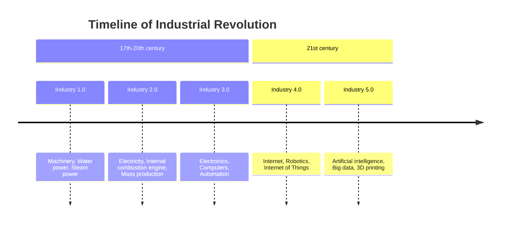

As you can see, the time periods are placed in the sections, and the sections are placed in the order they are defined.

All time periods and events under a given section follow a similar color scheme. This is done to make it easier to see the relationship between time periods and events.

## Wrapping of text for long time-periods or events

By default, the text for time-periods and events will be wrapped if it is too long. This is done to avoid that the text is drawn outside the diagram.

You can also use `<br>` to force a line break.

Let us look at another example, where we have a long time period, and a long event.

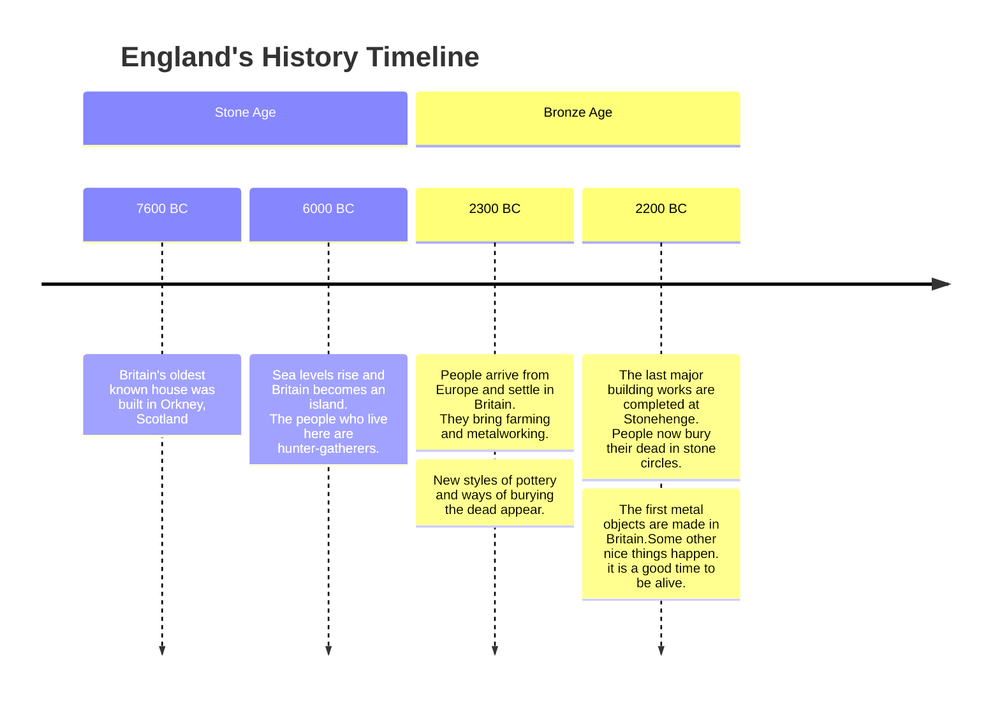

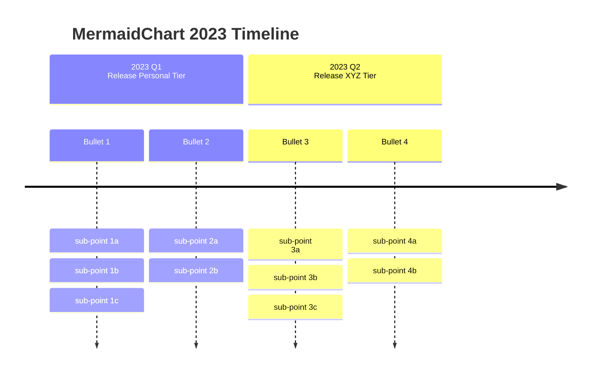

## Styling of time periods and events

As explained earlier, each section has a color scheme, and each time period and event under a section follow the similar color scheme.

However, if there is no section defined, then we have two possibilities:

1. Style time periods individually, i.e. each time period(and its corresponding events) will have its own color scheme. This is the DEFAULT behavior.


**NOTE**: that there are no sections defined, and each time period and its corresponding events will have its own color scheme.

2. Disable the multiColor option using the `disableMultiColor` option. This will make all time periods and events follow the same color scheme.

You will need to add this option either via mermaid.initialize function or directives.

```javascript
mermaid.initialize({
        theme: 'base',
        startOnLoad: true,
        logLevel: 0,
        timeline: {
          disableMulticolor: false,
        },
        ...
        ...
```

let us look at same example, where we have disabled the multiColor option.

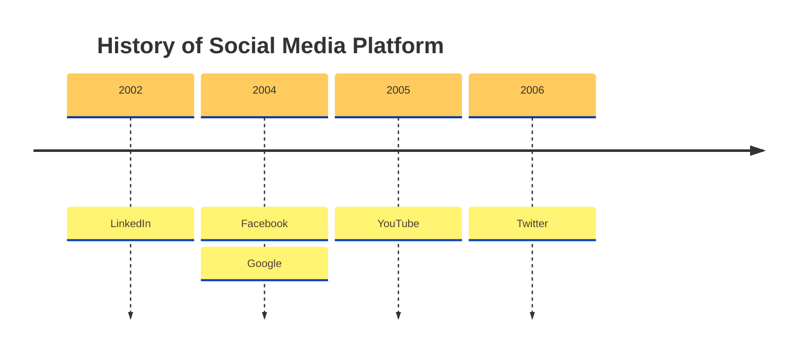

### Customizing Color scheme

You can customize the color scheme using the `cScale0` to `cScale11` theme variables, which will change the background colors. Mermaid allows you to set unique colors for up-to 12 sections, where `cScale0` variable will drive the value of the first section or time-period, `cScale1` will drive the value of the second section and so on.
In case you have more than 12 sections, the color scheme will start to repeat.

If you also want to change the foreground color of a section, you can do so use theme variables corresponding `cScaleLabel0` to `cScaleLabel11` variables.

**NOTE**: Default values for these theme variables are picked from the selected theme. If you want to override the default values, you can use the `initialize` call to add your custom theme variable values.

Example:

Now let's override the default values for the `cScale0` to `cScale2` variables:

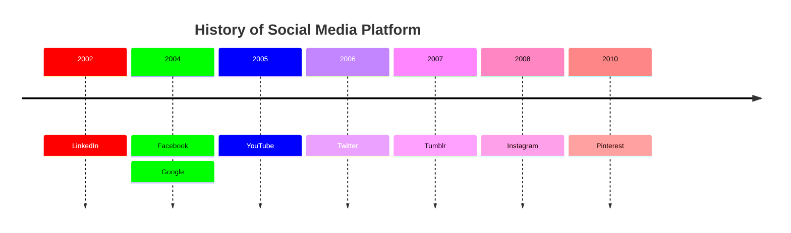

See how the colors are changed to the values specified in the theme variables.

## Themes

Mermaid supports a bunch of pre-defined themes which you can use to find the right one for you. PS: you can actually override an existing theme's variable to get your own custom theme going. Learn more about theming your diagram [here](../config/theming.md).

The following are the different pre-defined theme options:

- `base`
- `forest`
- `dark`
- `default`
- `neutral`

**NOTE**: To change theme you can either use the `initialize` call or _directives_. Learn more about [directives](../config/directives.md)
Let's put them to use, and see how our sample diagram looks in different themes:

### Base Theme

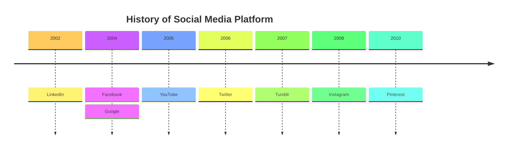

### Forest Theme

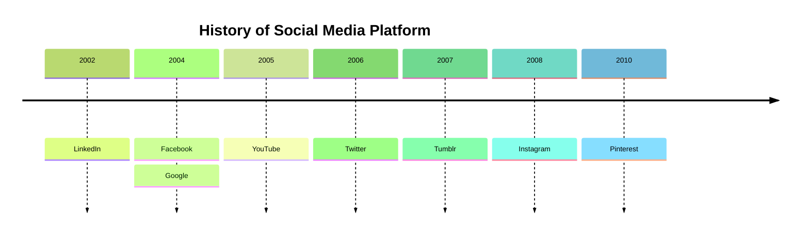

### Dark Theme

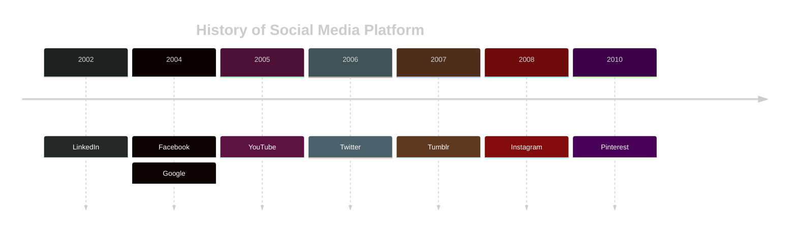

### Default Theme

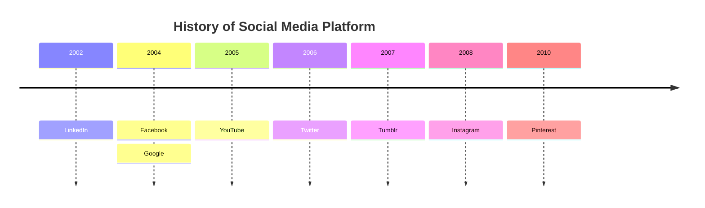

### Neutral Theme

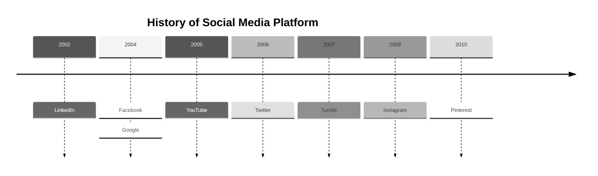

## Integrating with your library/website

Timeline uses experimental lazy loading & async rendering features which could change in the future.The lazy loading is important in order to be able to add additional diagrams going forward.

You can use this method to add mermaid including the timeline diagram to a web page:

```html
<script type="module">
  import mermaid from '<CDN_URL>/mermaid@<MERMAID_VERSION>/dist/mermaid.esm.min.mjs';
</script>
```

You can also refer the implementation in the live editor [here](https://github.com/mermaid-js/mermaid-live-editor/blob/develop/src/lib/util/mermaid.ts) to see how the async loading is done.
