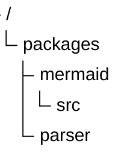
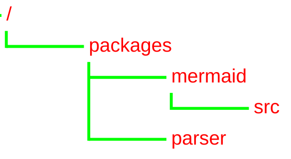

# TreeView Diagram (v11.14.0+)

## Introduction

A TreeView diagram is used to represent hierarchical data in the form of a directory-like structure.

## Syntax

The structure of the tree depends only on indentation.

```
treeView-beta
    "<folder name>"
        "<file name>"
        "<folder name>"
            "<file name>"
    "<file-name>"
```

## Examples





## Config Variables

| Property      | Description               | Default Value |
| ------------- | ------------------------- | ------------- |
| rowIndent     | Indentation for each row  | 10            |
| paddingX      | Horizontal padding of row | 5             |
| paddingY      | Vertical padding of row   | 5             |
| lineThickness | Thickness of the line     | 1             |

### Theme Variables

| Property      | Description            | Default Value |
| ------------- | ---------------------- | ------------- |
| labelFontSize | Font size of the label | '16px'        |
| labelColor    | Color of the label     | 'black'       |
| lineColor     | Color of the line      | 'black'       |
