# ZenUML

> ZenUML uses a different syntax to generate sequence diagrams.
> A Sequence diagram is an interaction diagram that shows how processes operate with one another and in what order.

Mermaid can render sequence diagrams with ZenUML. Note that ZenUML uses a different
syntax than the original Sequence Diagram in mermaid.


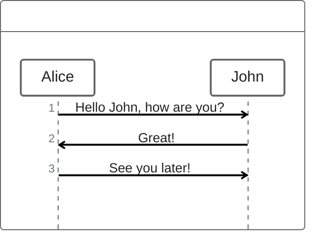

## Syntax

### Participants

The participants can be defined implicitly as in the first example on this page. The participants or actors are
rendered in order of appearance in the diagram source text. Sometimes you might want to show the participants in a
different order than how they appear in the first message. It is possible to specify the actor's order of
appearance by doing the following:

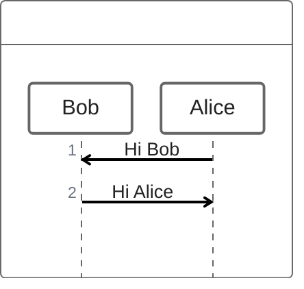

### Annotators

If you specifically want to use symbols instead of just rectangles with text you can do so by using the annotator syntax to declare participants as per below.

```mermaid-example
sequenceDiagram
    @Actor Alice
    @Database Bob
    Alice->Bob: Hi Bob
    Bob->Alice: Hi Alice
```
Here are the available annotators:


### Aliases

The participants can have a convenient identifier and a descriptive label.

```mermaid-example
sequenceDiagram
    A as Alice
    J as John
    A->J: Hello John, how are you?
    J->A: Great!
```

## Messages

Messages can be one of:
1. Sync message
2. Async message
3. Creation message
4. Reply message

### Sync message

You can think of a sync (blocking) method in a programming language.
```
A.SyncMessage
A.SyncMessage(with, parameters) {
  B.nestedSyncMessage()
}
```

### Async message
You can think of an async (non-blocking) method in a programming language. 
Fire an event and forget about it.
```
Alice->Bob: How are you?
```

### Creation message
We use `new` keyword to create an object.
```
new Object
```

### Reply message
There are three ways to express a reply message:

```
// 1. assign a variable from a sync message.
a = A.SyncMessage()

// 1.1. optionally give the variable a type
SomeType a = A.SyncMessage()

// 2. use return keyword
A.SyncMessage() {
  return result
}

// 3. use @return or @reply annotator on an async message
@return
A->B: result
```

The third way `@return` is rarely used, but it is useful when you want to return to one level up.

```
Client->A.method() {
  B.method() {
    if(condition) {
      return x1
      // mark a reply message from A to client and return early
      @return
      A->Client: x11
    }
  }
  return x2
}
```

## Nesting

Sync messages and Creation messages are naturally nestable with `{}`.

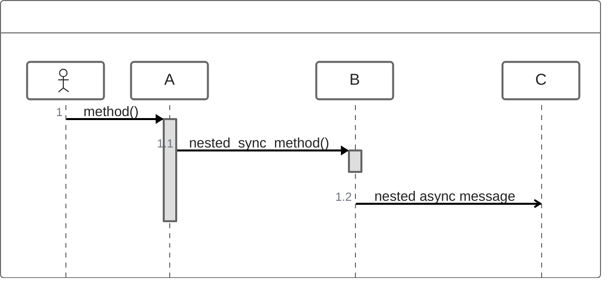
## Comments

It is possible to add comments to a sequence diagram with `// comment` syntax.

See the example below:

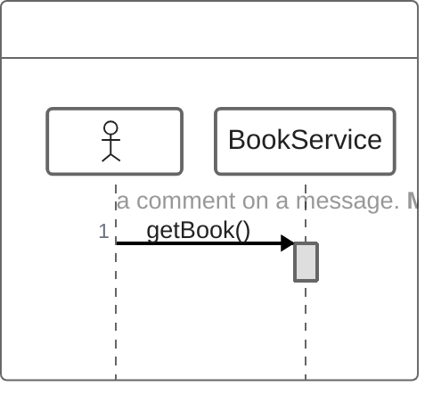

## Loops

It is possible to express loops in a ZenUML diagram. This is done by any of the 
following notations:
1. while
2. for
3. forEach, foreach
4. loop

```
while(condition) {
  ...statements...
}
```

See the example below:

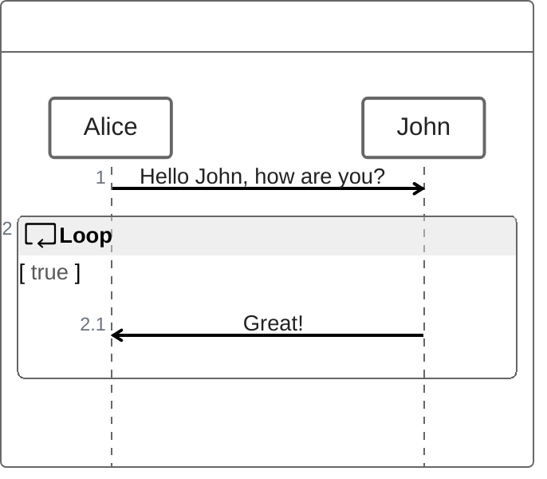

## Alt

It is possible to express alternative paths in a sequence diagram. This is done by the notation

```
if(condition1) {
  ...statements...
} else if(condition2) {
  ...statements...
} else {
  ...statements...
}
```

See the example below:

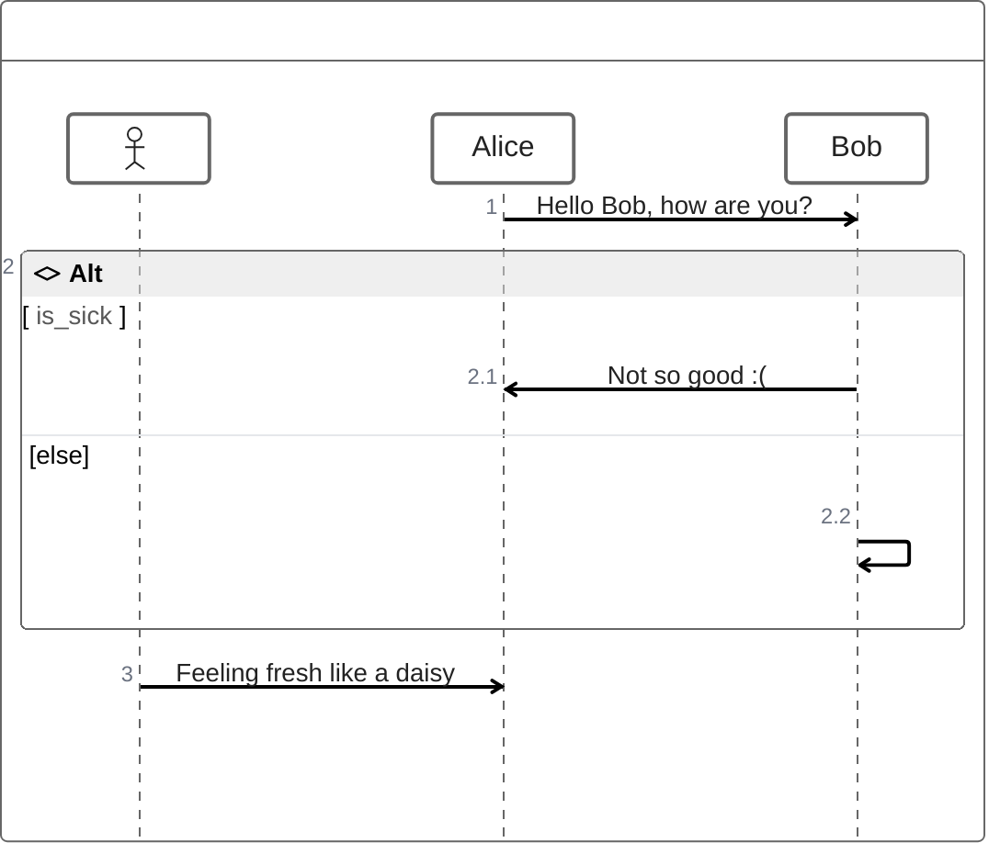

## Parallel

It is possible to show actions that are happening in parallel.

This is done by the notation

```
par {
  statement1
  statement2
  statement3
}
```

See the example below:

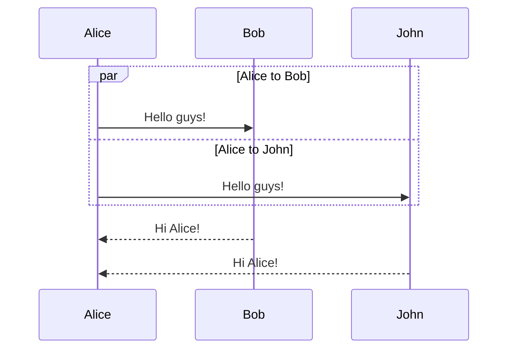

It is also possible to nest parallel blocks.

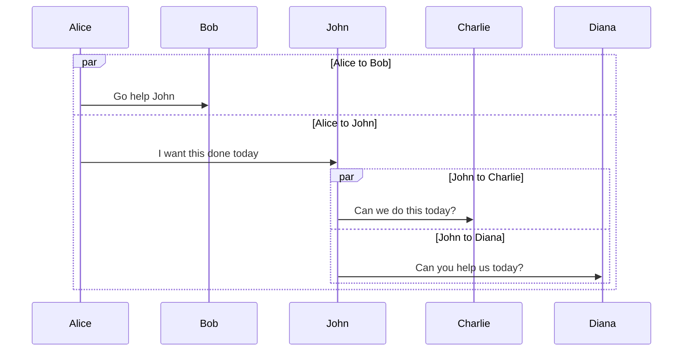

## Try/Catch/Finally (Break)

It is possible to indicate a stop of the sequence within the flow (usually used to model exceptions).

This is done by the notation

```
try {
  ...statements...
} catch {
  ...statements...
} finally {
  ...statements...
}
```

See the example below:

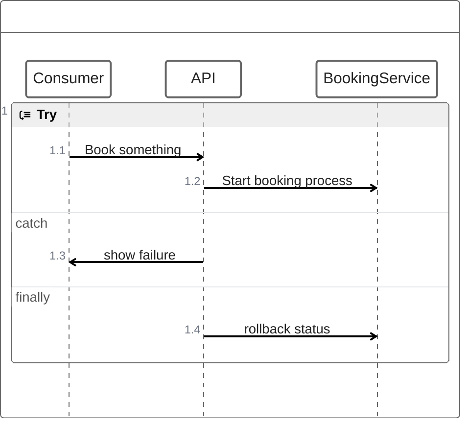

## Background Highlighting

It is possible to highlight flows by providing colored background rects. This is done by the notation

The colors are defined using rgb and rgba syntax.

```
rect rgb(0, 255, 0)
... content ...
end
```

```
rect rgba(0, 0, 255, .1)
... content ...
end
```

See the examples below:

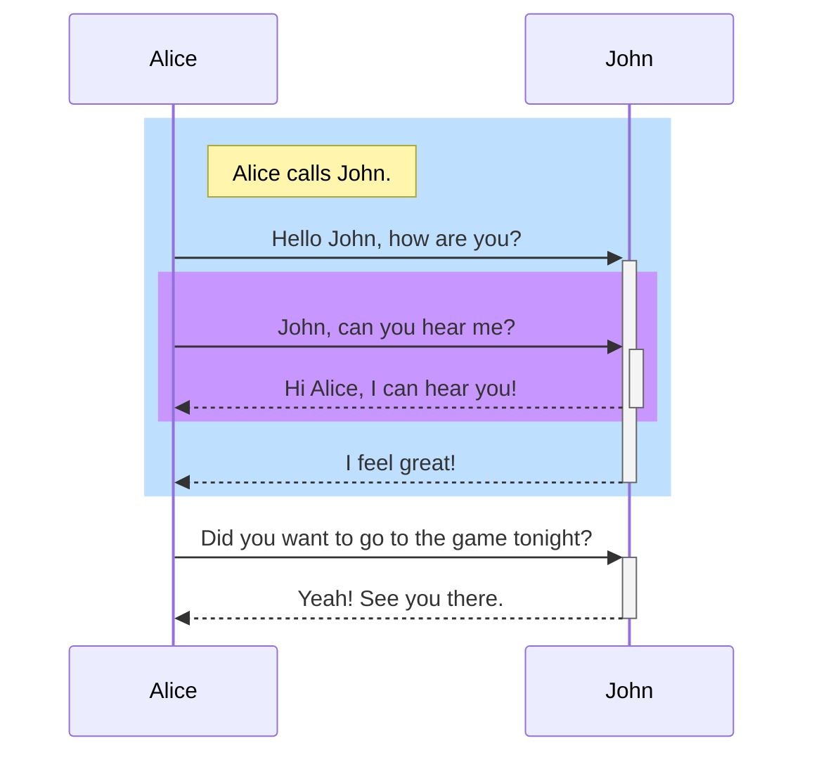

## Comments

Comments can be entered within a sequence diagram, which will be ignored by the parser. Comments need to be on their own line, and must be prefaced with `%%` (double percent signs). Any text after the start of the comment to the next newline will be treated as a comment, including any diagram syntax

```mmd
sequenceDiagram
    Alice->>John: Hello John, how are you?
    %% this is a comment
    John-->>Alice: Great!
```

## Entity codes to escape characters

It is possible to escape characters using the syntax exemplified here.

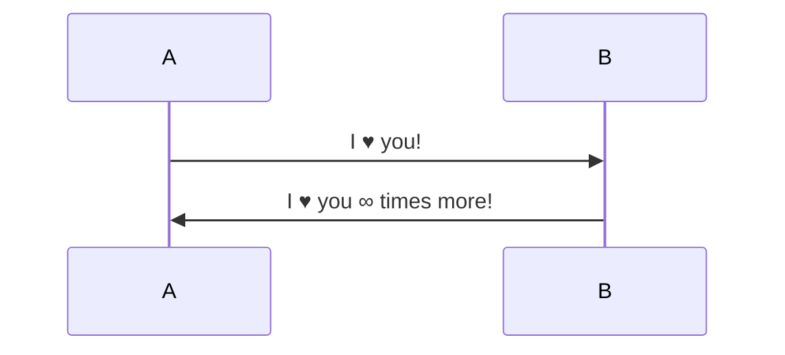

Numbers given are base 10, so `#` can be encoded as `#35;`. It is also supported to use HTML character names.

Because semicolons can be used instead of line breaks to define the markup, you need to use `#59;` to include a semicolon in message text.

## sequenceNumbers

It is possible to get a sequence number attached to each arrow in a sequence diagram. This can be configured when adding mermaid to the website as shown below:

```html
<script>
  mermaid.initialize({ sequence: { showSequenceNumbers: true } });
</script>
```

It can also be turned on via the diagram code as in the diagram:

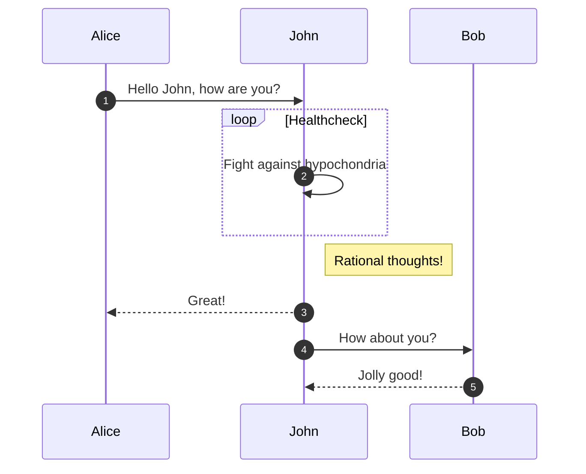

## Actor Menus

Actors can have popup-menus containing individualized links to external pages. For example, if an actor represented a web service, useful links might include a link to the service health dashboard, repo containing the code for the service, or a wiki page describing the service.

This can be configured by adding one or more link lines with the format:

```
link <actor>: <link-label> @ <link-url>
```

```mmd
sequenceDiagram
    participant Alice
    participant John
    link Alice: Dashboard @ https://dashboard.contoso.com/alice
    link Alice: Wiki @ https://wiki.contoso.com/alice
    link John: Dashboard @ https://dashboard.contoso.com/john
    link John: Wiki @ https://wiki.contoso.com/john
    Alice->>John: Hello John, how are you?
    John-->>Alice: Great!
    Alice-)John: See you later!
```

#### Advanced Menu Syntax

There is an advanced syntax that relies on JSON formatting. If you are comfortable with JSON format, then this exists as well.

This can be configured by adding the links lines with the format:

```
links <actor>: <json-formatted link-name link-url pairs>
```

An example is below:

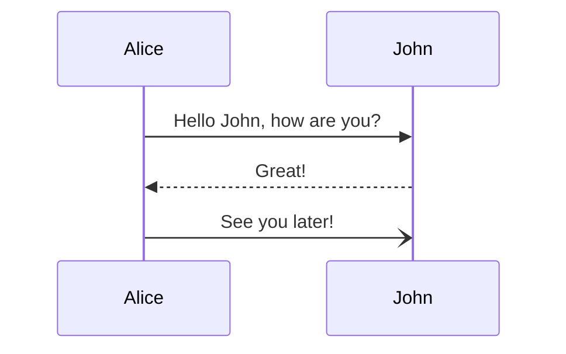

## Styling

Styling of a sequence diagram is done by defining a number of css classes. During rendering these classes are extracted from the file located at src/themes/sequence.scss

### Classes used

| Class        | Description                                                 |
| ------------ | ----------------------------------------------------------- |
| actor        | Style for the actor box at the top of the diagram.          |
| text.actor   | Styles for text in the actor box at the top of the diagram. |
| actor-line   | The vertical line for an actor.                             |
| messageLine0 | Styles for the solid message line.                          |
| messageLine1 | Styles for the dotted message line.                         |
| messageText  | Defines styles for the text on the message arrows.          |
| labelBox     | Defines styles label to left in a loop.                     |
| labelText    | Styles for the text in label for loops.                     |
| loopText     | Styles for the text in the loop box.                        |
| loopLine     | Defines styles for the lines in the loop box.               |
| note         | Styles for the note box.                                    |
| noteText     | Styles for the text on in the note boxes.                   |

### Sample stylesheet

```css
body {
  background: white;
}

.actor {
  stroke: #ccccff;
  fill: #ececff;
}
text.actor {
  fill: black;
  stroke: none;
  font-family: Helvetica;
}

.actor-line {
  stroke: grey;
}

.messageLine0 {
  stroke-width: 1.5;
  stroke-dasharray: '2 2';
  marker-end: 'url(#arrowhead)';
  stroke: black;
}

.messageLine1 {
  stroke-width: 1.5;
  stroke-dasharray: '2 2';
  stroke: black;
}

#arrowhead {
  fill: black;
}

.messageText {
  fill: black;
  stroke: none;
  font-family: 'trebuchet ms', verdana, arial;
  font-size: 14px;
}

.labelBox {
  stroke: #ccccff;
  fill: #ececff;
}

.labelText {
  fill: black;
  stroke: none;
  font-family: 'trebuchet ms', verdana, arial;
}

.loopText {
  fill: black;
  stroke: none;
  font-family: 'trebuchet ms', verdana, arial;
}

.loopLine {
  stroke-width: 2;
  stroke-dasharray: '2 2';
  marker-end: 'url(#arrowhead)';
  stroke: #ccccff;
}

.note {
  stroke: #decc93;
  fill: #fff5ad;
}

.noteText {
  fill: black;
  stroke: none;
  font-family: 'trebuchet ms', verdana, arial;
  font-size: 14px;
}
```

## Configuration

Is it possible to adjust the margins for rendering the sequence diagram.

This is done by defining `mermaid.sequenceConfig` or by the CLI to use a json file with the configuration.
How to use the CLI is described in the [mermaidCLI](../config/mermaidCLI.md) page.
`mermaid.sequenceConfig` can be set to a JSON string with config parameters or the corresponding object.

```javascript
mermaid.sequenceConfig = {
  diagramMarginX: 50,
  diagramMarginY: 10,
  boxTextMargin: 5,
  noteMargin: 10,
  messageMargin: 35,
  mirrorActors: true,
};
```

### Possible configuration parameters:

| Parameter         | Description                                                                                                                                | Default value                  |
| ----------------- | ------------------------------------------------------------------------------------------------------------------------------------------ | ------------------------------ |
| mirrorActors      | Turns on/off the rendering of actors below the diagram as well as above it                                                                 | false                          |
| bottomMarginAdj   | Adjusts how far down the graph ended. Wide borders styles with css could generate unwanted clipping which is why this config param exists. | 1                              |
| actorFontSize     | Sets the font size for the actor's description                                                                                             | 14                             |
| actorFontFamily   | Sets the font family for the actor's description                                                                                           | "Open Sans", sans-serif        |
| actorFontWeight   | Sets the font weight for the actor's description                                                                                           | "Open Sans", sans-serif        |
| noteFontSize      | Sets the font size for actor-attached notes                                                                                                | 14                             |
| noteFontFamily    | Sets the font family for actor-attached notes                                                                                              | "trebuchet ms", verdana, arial |
| noteFontWeight    | Sets the font weight for actor-attached notes                                                                                              | "trebuchet ms", verdana, arial |
| noteAlign         | Sets the text alignment for text in actor-attached notes                                                                                   | center                         |
| messageFontSize   | Sets the font size for actor<->actor messages                                                                                              | 16                             |
| messageFontFamily | Sets the font family for actor<->actor messages                                                                                            | "trebuchet ms", verdana, arial |
| messageFontWeight | Sets the font weight for actor<->actor messages                                                                                            | "trebuchet ms", verdana, arial |
