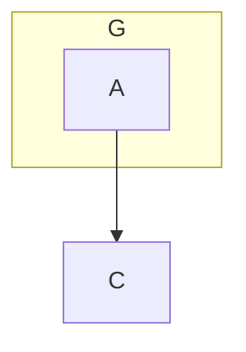

# Grid Edge-Routing Algorithm

The grid layout routes edges as deterministic orthogonal polylines. The router uses the measured
node and subgraph geometry produced by the layout; users never provide absolute coordinates or
waypoints.

The important design rule is that **grid cells are not obstacles**. A route may pass through unused
space in a cell. The obstacles are the measured node and subgraph rectangles, expanded by a small
clearance margin.

## Goals

The router aims to produce edges that:

- leave and enter nodes from sensible sides;
- contain only horizontal and vertical segments;
- avoid measured nodes, subgraphs, and subgraph titles;
- make each sparse hierarchy segment cross its required subgraph boundary exactly once;
- keep parallel and reverse edges visually distinct;
- remain deterministic across repeated renders;
- fail explicitly when no valid route exists;
- stay within fixed search and memory limits.

The router optimizes correctness before appearance. It validates every selected route against the
measured geometry before committing it.

## Inputs

Routing starts after the grid layout has measured and positioned every item. The router receives:

- each node's final rectangle;
- the parent subgraph of each node;
- per-item row, column, and corridor metadata from the completed layout result;
- per-container horizontal and vertical routing corridors;
- measured subgraph title rectangles;
- the diagram's edges;
- the configured curve and rounded-corner radius.

The router writes an ordered list of orthogonal points to each edge. Rendering the configured curve
from those points is a separate final step.

## Conceptual model

The diagram is treated as a hierarchy of independent routing containers:

```text
root diagram
├── node
├── subgraph
│   ├── node
│   └── nested subgraph
└── node
```

Each container has its own coordinate space, direct children, obstacles, and sparse routing
topology. An edge between nodes in different subgraphs is split into several container-local
segments. Paired portals join those segments across subgraph boundaries.

This avoids constructing one enormous graph for the whole diagram and makes boundary crossings
explicit and verifiable.

## Routing pipeline

### 1. Build an edge route plan

For each edge, the router finds the lowest common ancestor container of its endpoints.

It then walks from each endpoint toward that common container and records an endpoint chain. Each
entry identifies:

- the node or subgraph that owns the attachment;
- the preferred side of that owner;
- a stable demand key;
- the coordinate of the opposite endpoint;
- the preferred coordinate near the inner endpoint;
- whether the attachment is an ancestor-boundary portal.

For example, an edge from `A` inside `G` to an outside node `C` is planned as:

```text
A attachment
    -> interior side of G's boundary portal
    -> exterior side of G's boundary portal
    -> C attachment
```

The common ancestor for this edge is the root container.

### 2. Choose preferred sides

The preferred side is based on the dominant direction toward the other endpoint:

- mostly right: right side;
- mostly left: left side;
- mostly down: bottom side;
- mostly up: top side.

The router avoids the top of a subgraph when its title occupies that area. In that case it chooses a
horizontal side instead.

Side selection is a preference rather than an unconditional command. For ordinary same-container
edges, the router generates candidates on all legal sides. It first accepts the deterministic
corridor route when its ports are legal, the complete route passes measured-geometry validation,
and its length equals the Manhattan lower bound between those fixed ports. Otherwise, route search
selects the best candidate combination.

### 3. Allocate attachment coordinates

Hierarchy attachment demands that share an owner and side are allocated together.

The allocator provides:

- stable preferred coordinates for hierarchy attachments;
- stable ordering based on the opposite endpoint;
- a minimum separation between unrelated ports;
- 8-pixel lane offsets for parallel and reverse edge bundles;
- compact ancestor portals near their inner endpoints;
- legal clamping around subgraph corners and titles.

A singleton ancestor portal is not treated as a one-edge bundle. It remains near its endpoint rather
than being moved to the center of the entire subgraph side. Actual multi-edge bundles retain their
shared centered lane allocation.

Ordinary same-container endpoints use a separate candidate generator. A singleton edge normally
gets a preferred-side candidate near the center of that side, plus candidates on other legal sides.
When several edges use the same node, their preferred coordinates are ordered using the positions
of their opposite endpoints.

Inline node placement metadata and configuration placement maps affect routing indirectly by
changing the completed `GridLayoutResult`. The router consumes geometry and corridor metadata from
that result rather than reading placement syntax itself.

### 4. Build a sparse topology for each required container

The router builds topologies only for containers used by planned routes that still require sparse
search. Containers whose ordinary edges all satisfy the validated Manhattan-minimal fast path do
not pay topology-construction or endpoint-overlay costs.

For each container it:

1. collects its direct child nodes and subgraphs as obstacles;
2. adds the measured subgraph title as an exclusion;
3. expands obstacles by the routing clearance;
4. clips them to the container bounds;
5. unions overlapping obstacle rectangles;
6. creates seed vertices at:
   - container corners;
   - obstacle corners;
   - legal portal-range endpoints;
7. projects those seeds horizontally and vertically until they hit an obstacle or container
   boundary;
8. joins mutually visible adjacent vertices with horizontal or vertical arcs.

This produces a sparse orthogonal visibility graph. It represents useful routes around actual
geometry without enumerating every pixel or every logical grid-cell intersection.

Endpoint coordinates are added later through a lightweight overlay. The immutable base topology can
therefore be reused for multiple edges in the same container.

The portal records in the base topology describe the ends of legal portal ranges. A route's selected
paired portal may use another legal coordinate within that range; its interior and exterior points
are created when that route is assembled.

### 5. Generate endpoint candidates

For ordinary same-container edges, each endpoint receives a deterministic candidate list.

Candidates include:

- the preferred side and coordinate;
- separated coordinates for other edges incident on the same node;
- alternative legal sides;
- fixed terminal approach points outside the measured node.

Candidate pairs are sorted by a lower-bound estimate of route length, bends, and candidate rank.
Pairs that cannot beat the current best result are skipped.

For hierarchy segments, the endpoint attachments are already determined by the endpoint chain and
the allocated boundary portals.

### 6. Route within one container

Before sparse search, an unbundled ordinary same-container edge may use the deterministic corridor
route described above. The fast path is disabled when test-only resource caps or dual-route
comparison are requested, so those modes continue to exercise the sparse router.

If sparse routing is still required and two attachment connection points are aligned, the router
uses the direct orthogonal segment when it is valid. This prevents the sparse topology from
introducing a needless detour between already-visible attachments.

Otherwise, the connection points and their orthogonal projections are overlaid onto the container's
visibility graph. The router then searches that graph.

Search state includes both:

- the current topology vertex;
- the orientation of the segment used to reach it.

Including orientation allows the search to count bends accurately.

### 7. Compare routes lexicographically

Routes are compared using this tuple, in order:

1. total Manhattan length;
2. number of bends;
3. number of boundary transitions;
4. length overlapping occupied routing space;
5. number of crossings;
6. endpoint-candidate rank.

This is lexicographic rather than a weighted sum. Among candidates admitted by endpoint, obstacle,
bundle, and pair-route constraints, a shorter sparse route wins regardless of how many bends would
need to be traded to obtain it. When lengths are equal, fewer bends wins, and so on. Compatibility
routes and resource-limit fallbacks do not compete in this sparse-search tuple.

The current production visibility arcs contribute length and bend information. Boundary-transition
count is fixed by hierarchy decomposition, while occupied-length and crossing values are recorded
after routing for instrumentation rather than used as congestion costs. The tuple retains those
positions so a future indexed congestion model can add them without changing route ordering
semantics.

The search uses a bend-aware Manhattan heuristic. Canonical vertex and edge ordering provides
deterministic tie-breaking in addition to the tuple comparison.

### 8. Cross subgraph boundaries through paired portals

A sparse hierarchy route may cross a subgraph boundary only through a paired portal.

A portal consists of:

- an interior connection point, 6 pixels inside the boundary;
- the actual boundary point;
- an exterior connection point, 6 pixels outside the boundary;
- a straight 12-pixel transition joining the interior and exterior points.

Portal ranges exclude:

- subgraph corners;
- the subgraph title;
- coordinates outside the measured boundary.

The preferred portal coordinate is tried first. If a sparse hierarchy segment has no legal route,
the router tries at most three deterministic alternatives per portal on the same side: nearby
routing corridors first, then the range midpoint and endpoints. Lowest-common-ancestor segments may
combine bounded alternatives from both portals. The first child-container segment may also try up
to three alternate node sides after its preferred attachment fails. The first valid combination
becomes the paired portal selection used by the complete hierarchy route. Resource-limit failures
do not trigger extra searches; they use the bounded fallback policy described below.

The route inside the subgraph ends at the interior point. The parent-container route starts at the
matching exterior point. Both sides therefore agree on one exact boundary crossing.

The complete edge is assembled from:

```text
source-container segments
    + lowest-common-ancestor segment
    + reversed target-container segments
```

Consecutive duplicate and collinear points are removed after assembly.

### 9. Keep related edges distinct

Edges with the same unordered endpoint pair are routed as a bundle.

The router:

- assigns deterministic 8-pixel lane offsets;
- orders forward and reverse edges consistently;
- rejects candidates that reuse the same endpoint port;
- rejects non-terminal parallel segments that overlap or are separated by less than the lane
  spacing;
- routes later edges with the already committed pair routes as constraints.

If the geometry cannot support distinct legal lanes, routing fails with `GRID_ROUTE_NOT_FOUND`
instead of drawing several edges on top of one another.

Hierarchy bundles use sparse routing even when their individual compatibility routes are
obstacle-clear. Bundles of two through eight edges are committed atomically. If the normal order
fails, the router restores the pair-local portal, demand, occupancy, edge, and instrumentation state
and retries once, routing deeper hierarchy paths and outer lanes first.

As a final hierarchy-only recovery, a validated compatibility segment may share an interior
corridor with an already committed reverse or parallel route. Endpoint ports must still be distinct,
and the complete route must pass the normal obstacle and hierarchy validation. This relaxation is
not used for ordinary same-container bundles.

### 10. Handle self-loops

Self-loops use a related but separate search.

The router tries legal sides in a deterministic order and allocates progressively deeper loop tracks.
Each loop has separated start and end ports on the same node. Candidate loops are validated against
nearby obstacles and previously committed pair routes.

### 11. Validate before committing

Every route is normalized and checked before being assigned to an edge.

Validation rejects routes that:

- contain non-finite coordinates;
- contain diagonal segments;
- enter an inflated obstacle;
- cross the wrong subgraph boundary;
- use an illegal title or corner portal;
- violate parallel-edge separation;
- use terminal segments that are too short where a terminal approach is required.

The router does not silently return an invalid best-effort path.

### 12. Apply bounded fallback behavior

Topology construction and search have explicit caps for:

- vertex count;
- adjacency entries;
- estimated memory;
- expanded search states.

The deterministic compatibility router also serves as the normal fast path for hierarchy segments
whose corridor route is known to be valid. This is separate from fallback behavior.

When a segment has been selected for sparse routing, a resource-cap failure may switch it to the
compatibility route as a fallback. After an ordinary no-route result, the same compatibility route
may be used only as bounded recovery when it passes the full geometry checks and pair-route policy.
If it is invalid, the router throws `GRID_ROUTE_NOT_FOUND`.

No failure path returns an unverified route.

Routing instrumentation distinguishes resource fallbacks, bounded portal recovery, compatibility
recovery, pair-bundle retries, hierarchy separation relaxation, and the same-container fast path.
Fast-path metrics record attempts, accepted routes, geometry-validation failures, and valid routes
rejected because they exceeded the Manhattan lower bound.

### 13. Render the selected polyline

The router stores the orthogonal points on the edge and applies the configured grid curve:

- `rounded` uses the configured corner radius;
- `linear` preserves square corners;
- other supported Mermaid curves are applied by the shared renderer.

Curve rendering does not change obstacle avoidance. The orthogonal point sequence remains the
authoritative route.

## Current geometry constants

These are implementation details rather than syntax guarantees:

| Constant                 | Current value | Purpose                                              |
| ------------------------ | ------------: | ---------------------------------------------------- |
| Routing clearance        |          6 px | Space reserved around nodes, titles, and boundaries  |
| Terminal approach        |         20 px | Straight approach outside ordinary node ports        |
| Parallel lane separation |          8 px | Minimum visual separation for pair routes            |
| Minimum port separation  |          4 px | Minimum spacing between attachment demands           |
| Portal transition        |         12 px | Six pixels inside plus six pixels outside a boundary |

## Worked hierarchy example

Given:



with `G` to the left of `C`, the router:

1. identifies the root as the lowest common ancestor;
2. chooses the right side of `A`, `G`, and the left side of `C`;
3. allocates `G`'s singleton portal near `A` rather than at the center of `G`;
4. routes directly from `A` to the interior portal when that segment is clear;
5. crosses `G` through the paired portal;
6. performs any required vertical adjustment outside `G`;
7. approaches `C` horizontally from the left.

The edge therefore does not visit the top or bottom of `G`, does not overshoot both endpoints, and
crosses the boundary exactly once.

## Main implementation files

- `router.ts`
  - route planning (`collectRoutePlans`), endpoint allocation (`assignDemandCoordinates` and
    `endpointCandidates`), sparse container routing (`sparseContainerSegment`), pair constraints
    (`routeSatisfiesPairConstraints`), hierarchy assembly (`routeGridEdges`), and route validation;
- `routerTopology.ts`
  - obstacle processing and visibility-graph construction (`buildContainerRoutingTopology`),
    endpoint overlays (`buildEndpointRoutingOverlay`), and paired portals (`buildPairedPortal`);
- `routerSearch.ts`
  - lexicographic shortest-path search (`findShortestRoute`) and resource limits;
- `routerInstrumentation.ts`
  - route and resource metrics;
- `router.spec.ts`
  - focused routing regressions;
- `testMatrix.ddlt.spec.ts`
  - corpus-level route characterization and determinism checks.
