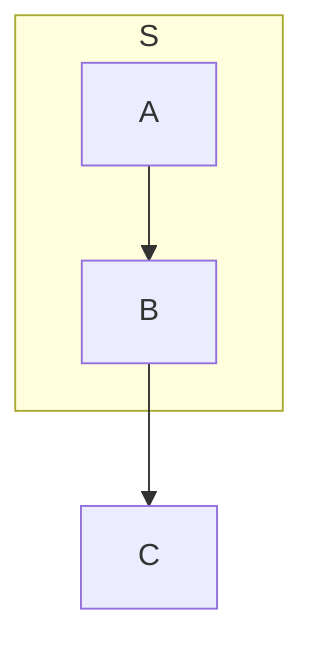

# Implementing a Faithful HOLA Layout in Mermaid Flowcharts

## 1. Goal

This document defines how to replace Mermaid's current experimental, HOLA-inspired pipeline with an implementation that follows the HOLA algorithm described in **Kieffer, Dwyer, Marriott, and Wybrow, “HOLA: Human-like Orthogonal Network Layout” (2015)**.

The target is **Mermaid flowcharts only**. The implementation must preserve the algorithmic decisions that distinguish HOLA from a generic force-directed layout followed by grid snapping:

- decomposition into a cyclic core and attached trees;
- low-stress layout maintained through hard alignment and separation constraints;
- node and chain configuration;
- deliberate aesthetic bends, including bends introduced inside edges;
- orthogonal core routing before planarisation;
- symmetric tree layout;
- face-based, largest-first tree placement with constraint-based expansion and backtracking;
- opportunistic alignment and neighbour-stress refinement;
- final routing that preserves deliberate bend points.

Two Mermaid-specific adaptations are normative for this implementation:

1. **Disconnected flowcharts:** split the input into weakly connected components, run the complete connected HOLA algorithm independently on each component, and pack the finished component drawings from left to right.
2. **Subgraphs:** do not render subgraph containers for now. Flatten their ordinary child nodes into the top-level graph and do not create group frames, group constraints, or group-routing obstacles.

The existing implementation should remain available behind its current experimental option until the faithful implementation passes the acceptance tests in this guide.

---

## 2. Source-of-truth policy

The HOLA paper is normative for the pipeline, ordering, objectives, and invariants. Several low-level procedures are delegated by the paper to earlier work rather than fully specified:

- constraint-based stress optimisation and gradient projection;
- fast overlap removal;
- Manning–Atallah symmetric tree layout;
- orthogonal connector routing;
- some details of chain bend costs and face-expansion generation.

For those procedures, a faithful implementation must do one of the following, in descending order of preference:

1. port or bind the corresponding implementation from the original Adaptagrams/HOLA code;
2. port the algorithm from the cited paper;
3. implement a demonstrably equivalent procedure and validate it with differential tests against the original implementation.

Do **not** silently substitute a visually similar heuristic. In particular, direct coordinate snapping, generic spring relaxation, bounding-box-only face placement, and a final router that discards deliberate bends are not equivalent replacements.

---

## 3. Explicit Mermaid semantics

### 3.1 Directionality

HOLA is a network-layout algorithm, not a layered directed-layout algorithm. Therefore:

- use an **undirected projection** of the flowchart for connectivity, degree, shortest-path distance, decomposition, stress, and symmetry;
- retain each original edge's `start`, `end`, arrowheads, classes, and rendering metadata;
- restore direction only when writing the final routed edge back to Mermaid;
- never remove an edge because it participates in a directed cycle;
- never choose the cyclic core from a directed acyclic rewrite.

The Mermaid flowchart declaration direction (`TD`, `LR`, and so on) should not change the HOLA topology. HOLA's own orientation step determines whether the final component is rotated.

### 3.2 Subgraphs

For the first faithful version, subgraphs are flattened rather than laid out as containers.

Normative behaviour:

- exclude every group/container node from the HOLA node set;
- retain every ordinary descendant node, including descendants of nested subgraphs;
- clear `parentId` or equivalent group ownership in the internal layout graph;
- retain an edge when both endpoints are ordinary nodes;
- do not calculate, draw, resize, move, or route around a subgraph frame;
- do not add synthetic parent-child or orphan-handler edges;
- do not run any current group finalisation or group-overlap pass.

An edge whose endpoint is the subgraph container itself cannot be represented faithfully while the container is not rendered. For this version:

- omit that edge from the layout result;
- emit a structured diagnostic such as `HOLA_SUBGRAPH_ENDPOINT_UNSUPPORTED` containing the edge and group IDs;
- do not redirect it to an arbitrary child.

### 3.3 Edge labels

Do not turn edge labels into graph nodes. Label-node injection changes node degree, leaf peeling, the cyclic core, stress, and face structure.

Instead:

1. carry label metadata on the original edge;
2. run HOLA on the actual endpoint topology;
3. after final routing, place the label on a suitable route segment;
4. when necessary, reroute or slide the label along the route to avoid collisions.

A recommended first policy is to place the label at the midpoint of the longest usable horizontal or vertical segment, with a configurable offset. Label collision handling is a Mermaid integration pass and must not alter HOLA decomposition.

### 3.4 Parallel edges and self-loops

The HOLA topology should be a simple undirected graph:

- collapse parallel edges to one topological adjacency for degree, decomposition, graph distance, and stress;
- retain a bundle mapping from the topological edge to all original Mermaid edges;
- exclude self-loops from degree and graph-distance calculations;
- route every original parallel edge and self-loop in the final routing phase.

This prevents parallel edges from falsely increasing a node's structural degree while preserving the original Mermaid diagram.

---

## 4. Non-negotiable invariants

The implementation is not faithful unless all of the following hold.

1. **No cycle-edge removal.** A cycle remains part of the core.
2. **No label nodes in topology.** Edge labels are annotations, not graph vertices.
3. **The whole graph is split into components before HOLA.** Do not decompose one global graph and only later notice disconnected cores.
4. **Node overlap removal follows initial core stress layout.** It is not postponed until the end.
5. **Alignment and separation are hard constraints.** They survive later stress optimisation.
6. **Node configuration maximises the number of configured neighbours first, then minimises angular displacement.** A locally greedy matching is insufficient.
7. **Chain configuration can create a bend inside an edge.** Such a bend is recorded as mandatory.
8. **Remaining diagonal core edges are routed before planarisation.**
9. **Every core node uses at least two connector sides before planarisation.**
10. **Tree layout is the Manning–Atallah symmetric layout or a validated equivalent.**
11. **Tree edges are routed orthogonally during tree layout.**
12. **Planarisation operates on axis-aligned routes and preserves distinct inner and outer faces.**
13. **Trees are considered in descending bounding-box perimeter.**
14. **Placement choice is lexicographic by default: cardinal direction, then external face, then stress increase.**
15. **Face expansion is performed with separation constraints, projection, stress measurement, and backtracking.**
16. **Actual tree nodes are not inserted while evaluating placements.** Use placeholders until restoration.
17. **All coordinate changes after constraints exist either update the constraint system or are followed by constrained projection.**
18. **Final routing passes through every mandatory chain bend.**
19. **Subgraph containers never enter the layout graph in this version.**
20. **Disconnected components never exert stress, obstacle, alignment, or routing influence on one another.**

---

## 5. Target architecture

Create a clean implementation alongside the current experimental one rather than incrementally patching the existing pipeline. The present code mixes HOLA stages with group handling, cycle removal, label-node injection, late overlap forces, and a separate router. A parallel implementation makes algorithmic review and differential testing substantially easier.

Suggested structure:

```text
hola-faithful/
  index.ts
  options.ts
  diagnostics.ts
  model.ts
  adapter/
    flattenFlowchart.ts
    edgeBundles.ts
    labels.ts
  components/
    connectedComponents.ts
    packComponents.ts
  connected/
    layoutConnectedHola.ts
  decomposition/
    peelCoreAndTrees.ts
    treeRoot.ts
  constraints/
    types.ts
    solver.ts
    vpscBackend.ts
    rotateConstraints.ts
  stress/
    graphDistances.ts
    stressModel.ts
    gradientProjection.ts
    overlapRemoval.ts
  orthogonalization/
    nodeConfiguration.ts
    chains.ts
    chainConfiguration.ts
    bendSites.ts
  routing/
    coreRouting.ts
    finalRouting.ts
    ports.ts
    mandatoryWaypoints.ts
  trees/
    symmetricTreeLayout.ts
    treeRouting.ts
  planarization/
    segments.ts
    sweep.ts
    dcel.ts
    faces.ts
  placement/
    candidates.ts
    faceExpansion.ts
    placeTrees.ts
    placeholders.ts
  improvement/
    opportunisticAlignment.ts
    neighbourStress.ts
    rotation.ts
  restore/
    restoreOriginalGraph.ts
  tests/
    fixtures/
    unit/
    integration/
    golden/
```

Expose the new implementation under a separate feature value, for example `layout: 'hola-faithful'`, until it replaces the current experimental implementation.

---

## 6. Internal data model

Do not use Mermaid renderer objects directly inside the algorithm. Convert them into an explicit, immutable-topology layout model.

```ts
interface HolaNode {
  id: string;
  width: number;
  height: number;
  inputOrder: number;

  // Mutable layout state.
  x: number;
  y: number;

  // Original Mermaid node metadata for write-back only.
  original: unknown;
}

interface HolaEdge {
  id: string; // Topological/layout edge ID.
  source: string;
  target: string;
  originalEdgeIds: string[]; // Bundle of Mermaid edges.

  route: Point[];
  sourceSide?: Side;
  targetSide?: Side;
  mandatoryWaypoints: MandatoryWaypoint[];
}

interface MandatoryWaypoint {
  id: string;
  originalEdgeId: string;
  order: number;
  x: number;
  y: number;
  source: 'chain-aesthetic-bend';
}

interface HolaGraph {
  nodes: Map<string, HolaNode>;
  edges: Map<string, HolaEdge>;
  adjacency: Map<string, Set<string>>; // Unique undirected neighbours.
}
```

Additional internal types are needed for:

- copied tree roots;
- dummy bend and crossing nodes;
- original-edge provenance through planarisation;
- half-edges and faces;
- tree placeholders;
- hard constraints;
- snapshots used for backtracking.

Keep original IDs distinct from internal IDs. Use typed IDs or prefixed objects rather than testing whether an ID contains `_` or `-`.

---

## 7. Required constraint and optimisation foundation

This is the most important infrastructural change. HOLA relies on constrained optimisation throughout the pipeline. A collection of direct assignments such as `u.x = v.x` is not enough.

### 7.1 Constraint types

At minimum support:

```ts
type Axis = 'x' | 'y';

interface AlignmentConstraint {
  kind: 'alignment';
  axis: Axis;
  a: NodeId;
  b: NodeId;
  offset: number; // Usually zero.
}

interface SeparationConstraint {
  kind: 'separation';
  axis: Axis;
  leftOrAbove: NodeId | BlockId;
  rightOrBelow: NodeId | BlockId;
  gap: number;
}
```

In Mermaid coordinates, `y` increases downward.

Examples:

```text
u EAST of v:
  y(u) = y(v)
  x(u) - x(v) >= width(v)/2 + width(u)/2 + clearance

u NORTH of v:
  x(u) = x(v)
  y(v) - y(u) >= height(v)/2 + height(u)/2 + clearance
```

### 7.2 Projection contract

The solver must project candidate positions onto the feasible region while moving nodes as little as possible:

```text
minimise Σ_i weight_i · (coordinate_i - desired_i)^2
subject to all alignment and separation constraints.
```

Projection is normally solved independently on the `x` and `y` axes with a VPSC-style solver. The solver API must support:

```ts
interface ConstraintSystem {
  add(constraint: Constraint): ConstraintId;
  addAll(constraints: Constraint[]): ConstraintId[];
  remove(ids: ConstraintId[]): void;

  snapshot(): ConstraintSnapshot;
  restore(snapshot: ConstraintSnapshot): void;

  isFeasible(additional: Constraint[]): boolean;
  project(nodes: Map<NodeId, HolaNode>): ProjectionResult;
  rotate90(direction: 'cw' | 'ccw'): void;
}
```

### 7.3 Gradient projection

Stress optimisation under hard constraints must use gradient projection, not unconstrained spring movement followed by ad hoc snapping.

```text
repeat until convergence:
    desiredPositions <- currentPositions - stepSize * stressGradient
    currentPositions <- project(desiredPositions, hardConstraints)
    reduce step size when stress does not improve
```

The same mechanism is used for:

- stress recovery after node configuration;
- stress recovery after all tree placements;
- neighbour-only stress optimisation;
- the post-rotation neighbour-stress pass.

### 7.4 Stress model

The HOLA paper delegates the exact implementation to its constraint-layout foundation. For full fidelity, port the original Adaptagrams/libcola stress implementation.

The expected structure is the standard graph stress model:

```text
Stress = Σ_(i<j) w_ij · (distance(i,j) - idealDistance_ij)^2

idealDistance_ij = baseEdgeLength · shortestPathDistance(i,j)
w_ij             = 1 / shortestPathDistance(i,j)^2
```

Node dimensions should be handled consistently with the original solver, while non-overlap is enforced through separation constraints. Do not retain the current implementation's unverified mixture of boundary distance in the objective and centre-distance gradients.

### 7.5 Overlap removal

Immediately after the initial core stress layout:

1. detect overlapping node rectangles;
2. generate horizontal or vertical separation constraints using the fast overlap-removal method;
3. add the constraints to the persistent system;
4. project;
5. repeat until no overlap remains.

A late force-based overlap pass must not be allowed to break established alignments, tree placements, or face topology. A final overlap check may assert or report failure, but it should not mutate the layout outside the constraint system.

---

## 8. Master pipeline

```text
PROCEDURE LayoutMermaidFlowchartWithHola(input, options):

    flat <- FlattenSubgraphsAndBuildTopology(input)
    components <- WeaklyConnectedComponents(flat.topology)
    components <- StableSortByFirstInputNode(components)

    componentResults <- []

    FOR EACH component IN components:
        result <- LayoutConnectedHola(component, options)
        result <- RouteOriginalParallelEdgesAndSelfLoops(result)
        result <- PlaceEdgeLabels(result)
        componentResults.APPEND(result)

    packed <- PackComponentsLeftToRight(componentResults, options.componentGap)
    return WriteBackToMermaid(input, packed, flat.diagnostics)
```

```text
PROCEDURE LayoutConnectedHola(G, options):

    decomposition <- TopologicalDecomposition(G)

    IF decomposition.core is empty:
        tree <- decomposition.singleTree
        treeLayout <- SymmetricTreeLayout(tree, SelectPureTreeRoot(tree))
        RouteTreeEdgesOrthogonally(treeLayout)
        return FinalisePureTreeComponent(treeLayout)

    state <- InitialStressLayout(decomposition.core)
    state <- RemoveOverlapsWithConstraints(state)

    state <- ConfigureCoreNodes(state)
    state <- GradientProjectAllPairStress(state)

    state <- ConfigureCoreChains(state)
    state <- RouteRemainingCoreEdgesOrthogonally(state)

    treeLayouts <- []
    FOR EACH attachedTree:
        treeLayout <- SymmetricTreeLayout(attachedTree, attachedTree.rootCopy)
        RouteTreeEdgesOrthogonally(treeLayout)
        treeLayouts.APPEND(treeLayout)

    planar <- PlanariseOrthogonalCore(state)
    planar <- PlaceTreesWithConstraints(planar, treeLayouts)
    planar <- GradientProjectAllPairStress(planar)

    planar <- OpportunisticallyAlign(planar)
    planar <- GradientProjectNeighbourStress(planar)
    planar <- RotateLandscapeIfNeeded(planar)

    restored <- RestoreOriginalCoreAndTreeNodes(planar)
    restored <- FinalOrthogonalRouting(restored, mandatoryWaypoints)

    return restored
```

---

## 9. Mermaid adapter and disconnected components

### 9.1 Flattening

```text
PROCEDURE FlattenSubgraphsAndBuildTopology(input):

    groupIds <- IDs of every subgraph/container node
    ordinaryNodes <- every node whose ID is not in groupIds

    FOR EACH ordinaryNode:
        copy it into the flat graph
        discard parent/group ownership in the internal copy

    FOR EACH original edge e:
        IF e.source and e.target are ordinary nodes:
            retain e
        ELSE IF either endpoint is a group:
            emit HOLA_SUBGRAPH_ENDPOINT_UNSUPPORTED
            omit e from the layout topology

    collapse parallel adjacencies for the topology
    retain original-edge bundles for final routing
    retain self-loops separately

    return flat graph + metadata + diagnostics
```

Do not call any of the current true-subgraph, orphan-handler, group-bounds, group-overlap, group-dragging, or subgraph-boundary-routing procedures.

### 9.2 Component extraction

Compute weakly connected components over unique undirected neighbours. Direction does not matter.

- A single isolated node is a one-node component.
- A node with only self-loops is also a one-node component.
- Parallel edges do not create additional connectivity.

Each component receives a completely independent constraint system, stress model, router, planarisation, and face set.

### 9.3 Component packing

Run packing only after each component has completed final routing and label placement.

```text
PROCEDURE PackComponentsLeftToRight(results, gap):

    cursorX <- 0

    FOR EACH result in stable component order:
        bounds <- union of:
            node rectangles,
            edge-route points,
            edge-label rectangles,
            self-loop extents

        translateX <- cursorX - bounds.minX
        translateY <- -bounds.minY       // top-align components at y = 0

        TranslateEntireComponent(result, translateX, translateY)

        cursorX <- cursorX + bounds.width + gap

    return union of translated results
```

Recommended default:

```text
componentGap = max(100px, 2 * baseEdgeLength)
```

Packing must be a rigid translation. Do not rerun routing or stress across packed components.

---

## 10. HOLA Step 1: topological decomposition

The connected input is decomposed using undirected degree and the original graph topology.

### 10.1 Pure-tree detection

The paper's prose leaves the root choice for an entirely acyclic graph under-specified. Handle this before core peeling:

```text
IF connected simple graph has |E| = |V| - 1:
    treat the whole component as one tree
```

Use the tree centre as the deterministic default root:

1. compute eccentricity or repeatedly peel leaves;
2. choose the unique centre when one exists;
3. when two centres exist, choose the one with smaller `inputOrder`.

This is a Mermaid integration decision, not a directed-flow heuristic. Do not select roots from in-degree unless a future explicitly non-HOLA option requests it.

### 10.2 Mixed core-and-tree decomposition

For a component containing at least one cycle:

```text
PROCEDURE TopologicalDecomposition(G):

    active <- all nodes
    degree[v] <- number of active unique undirected neighbours
    L <- empty set of pruned nodes
    rho <- empty map

    REPEAT:
        leaves <- every active node with degree 1
        IF leaves is empty:
            BREAK

        // Record all attachments before removing the round.
        FOR EACH leaf l in leaves:
            rho[l] <- its unique active neighbour

        FOR EACH leaf l in leaves:
            active.remove(l)
            L.add(l)
            decrement the degree of its active neighbour

    coreNodes <- active
    coreEdges <- original topological edges with both endpoints in coreNodes

    H.nodes <- copies of every node in L
    H.edges <- original topological edges with both endpoints in L

    roots <- empty map from core node to copied root

    FOR EACH l in L:
        IF rho[l] is in coreNodes:
            r <- rho[l]
            IF roots does not contain r:
                roots[r] <- create copied root r'
                H.addNode(r')
            H.addEdge(l, roots[r])

    trees <- connected components of H

    ASSERT every tree contains exactly one copied core root

    return core + trees + root provenance
```

Important differences from the current implementation:

- do not peel label nodes specially;
- do not path-compress `rho` before constructing the pruned forest;
- do not use directed topological sorting to define the core;
- do not merge trees by Mermaid hierarchy;
- do not add missing hierarchy nodes or implicit parent-child edges;
- do not remove any cycle edge first.

---

## 11. HOLA Step 2a: initial core layout

### 11.1 Initial positions

Use the original HOLA/Adaptagrams initialisation when porting the solver. If a temporary deterministic initialisation is needed during development, use a stable circular or stress-majorisation seed, not input array order alone.

### 11.2 Stress optimisation

Compute a locally low-stress layout of the core with no alignment constraints initially. Then immediately run constraint-based overlap removal.

Exit criteria should be solver-based:

- relative stress improvement below tolerance;
- maximum gradient norm below tolerance;
- or a safe iteration cap.

Expose tolerances in one HOLA options object rather than scattering constants through the code.

---

## 12. HOLA Step 2b, part 1: node configuration

A **link** is a core node of undirected degree 2. Links do not participate in node configuration.

### 12.1 Processing order

```text
hubs <- core nodes with degree >= 3
sort hubs by:
    1. descending degree;
    2. ascending input order as deterministic tie-break.
```

### 12.2 Exact configuration search

For a hub `v`, enumerate partial injective assignments from neighbours to `{N, S, E, W}`. At most one neighbour may occupy a direction.

The objective is lexicographic:

1. maximise the number of assigned neighbours;
2. minimise total angular displacement;
3. use stable deterministic tie-breaks.

A correct exhaustive search is practical because only four directions exist:

```text
PROCEDURE FindBestConfiguration(v):

    neighbours <- N(v)
    sourceCircularOrder <- neighbours sorted by current angle around v

    FOR k from min(4, |neighbours|) down to 0:
        feasible <- []

        FOR EACH subset S of neighbours with size k:
            FOR EACH injective assignment q: S -> {N,S,E,W}:
                IF ReversesOrthogonalOrder(v, q): continue
                IF ChangesCyclicOrder(sourceCircularOrder, q): continue

                constraints <- ConstraintsForConfiguration(v, q)
                IF solver.isFeasible(constraints):
                    cost <- sum angular displacement for assigned neighbours
                    feasible.append(q, constraints, cost)

        IF feasible is not empty:
            return minimum-cost feasible configuration
```

Do not replace this with a greedy `(neighbour, direction)` matching plus a local fallback. That can fail both the maximum-cardinality and minimum-angular-displacement objectives.

### 12.3 Orthogonal-order preservation

If a neighbour begins left of `v`, it cannot be assigned EAST. If it begins above `v`, it cannot be assigned SOUTH, and so on. These inequalities remain valid after projection.

### 12.4 Cyclic-order preservation

The circular order of assigned neighbours around `v` must be a cyclic subsequence of the original circular order, with the same orientation. Validate the complete assigned subset, including wrap-around; do not skip the wrap-around test merely because some neighbours are unassigned.

### 12.5 Constraint application

For every accepted direction, add both:

- the corresponding centre alignment;
- the corresponding minimum separation.

Commit the configuration, project immediately, and then continue to the next hub. A hub is not an immovable anchor: the solver may move all nodes as required by the complete constraint system.

### 12.6 Post-node-configuration stress recovery

After all hubs have been configured, run full graph stress gradient projection under every accumulated constraint. This stage must meaningfully move unconstrained chains and rebalance the core.

---

## 13. HOLA Step 2b, part 2: chain configuration

### 13.1 Chain identification

Find maximal connected subgraphs consisting entirely of degree-2 links.

For an open chain, retain:

```text
u - v1 - v2 - ... - vk - w
```

where each `vi` has degree 2 and `u`, `w` do not.

A component whose core is a closed degree-2 cycle has no anchors. The HOLA paper does not spell out this case. The faithful implementation should handle it through the paper's configurable ACA chain-processing path or by porting the original HOLA closed-cycle handling. Do not invent a spiral layout as part of the default HOLA algorithm.

### 13.2 Endpoint direction candidates

For each chain endpoint:

- if node configuration already fixed the first/last link direction, use that direction;
- otherwise consider the two cardinal directions consistent with the current horizontal and vertical ordering.

### 13.3 Minimal bend-sequence enumeration

For every start/end direction pair, enumerate every bend sequence with the minimum number of turns permitted by the endpoint positions and directions.

This should be ported from the orthogonal connector-routing logic used by the original algorithm. The result is a sequence of turn directions, not merely one arbitrary L- or Z-shaped polyline.

### 13.4 Candidate bend sites

For each required turn, consider both:

1. an existing link node;
2. a point introduced inside a chain edge.

Represent an edge-interior choice as an explicit internal bend object with original-edge provenance. The bend remains mandatory through final routing.

### 13.5 Bend-site cost

The paper defines the criterion but not the exact increasing function:

- for an edge site, measure how close the edge's current slope is to `+1` or `-1`, with sign selected by turn direction;
- for a node site, construct the isosceles-triangle measure described by HOLA and evaluate the slope of its base;
- apply the original increasing cost function;
- greedily choose locally optimal ordered sites for the required turn sequence;
- sum the costs and choose the best minimal-bend sequence.

Because the exact cost function is not printed in the paper, port it from the original HOLA source rather than choosing an arbitrary substitute.

### 13.6 Enforcing a chain plan

For the selected plan:

- create internal dummy bends for edge-interior sites;
- add horizontal or vertical alignment constraints for every chain segment between successive sites;
- add necessary ordering/separation constraints;
- project onto the new constraints;
- record every deliberate edge-interior bend as a mandatory final-routing waypoint.

Do not simply assign existing chain nodes to generated corner coordinates, and do not discard excess chain nodes onto the final segment.

---

## 14. HOLA Step 2c: orthogonal core routing

This stage must occur before planarisation.

### 14.1 Router contract

The core router must support:

- rectangular node obstacles;
- fixed or allowed endpoint sides;
- orthogonal paths only;
- preservation of already straight, axis-aligned connectors when possible;
- mandatory waypoints;
- route-cost optimisation;
- no path through a foreign node rectangle.

Mermaid's current pattern/A\* router may be reused only after it is adapted to satisfy this contract.

### 14.2 Two-side invariant

Before planarisation, every core node must have incident connectors attached to at least two distinct sides.

A practical enforcement pass is:

1. route all unresolved edges with candidate side pairs;
2. inspect side usage per core node;
3. for a node using only one side, identify an incident edge with the lowest-cost feasible alternative side;
4. reroute it on a second side;
5. repeat until the invariant holds or report a routing failure.

Do not planarise a core containing diagonal segments. Assert that every route segment is horizontal or vertical.

---

## 15. HOLA Step 3a: symmetric tree layout

### 15.1 Required algorithm

Use the Manning–Atallah symmetric tree-layout algorithm or the exact tree implementation from the original HOLA code.

The required output contract is:

- a rooted tree;
- provisional SOUTH growth;
- each rank horizontally aligned below the previous rank;
- exact reflection symmetry when the rooted tree is symmetric;
- c-tree pairing to maximise symmetry otherwise;
- bounding box including node rectangles and tree-edge routes;
- the copied root's position;
- orthogonally routed parent-child edges.

Remove heuristic similarity thresholds and custom weighted pairing scores unless they are part of the ported algorithm.

### 15.2 Tree-edge routing

Route every parent-child edge during tree layout:

- parent connection on the side facing the child's rank;
- child connection on the side facing the parent's rank;
- orthogonal connector between them;
- preserve route points when rotating or flipping the tree.

This routing cannot remain commented out.

---

## 16. HOLA Step 3b: core planarisation

The input is the already orthogonally routed core.

### 16.1 Route-segment model

Convert every core edge route into ordered axis-aligned segments carrying:

- original topological edge ID;
- original Mermaid edge bundle IDs;
- segment order;
- whether an endpoint is a deliberate mandatory bend;
- port-side provenance.

### 16.2 Pass 1: bend dummies and overlap removal

1. Insert a dummy node at every route bend.
2. Split each route into edges between original or dummy nodes.
3. After splitting, remove duplicate overlapping edges between the same node pair.
4. Preserve a provenance list for every removed duplicate so original edges can be restored later.

Do not deduplicate complete original edges before splitting. HOLA removes duplicate **segments** exposed by bend insertion.

### 16.3 Pass 2: crossing dummies

Use an axis-aligned sweep to find horizontal/vertical crossings.

For every proper crossing:

1. create one crossing dummy node;
2. split both segments at the crossing;
3. preserve original-edge provenance and segment order.

A pairwise fallback is acceptable only for a first small-graph version, but the interface should permit replacement by the `O(n log n)` sweep.

### 16.4 DCEL/half-edge embedding

Build faces from directed half-edges rather than a list of node IDs.

```ts
interface HalfEdge {
  id: string;
  origin: NodeId;
  twin: HalfEdgeId;
  next: HalfEdgeId;
  face?: FaceId;
}
```

At each node, sort outgoing half-edges by geometric angle. Define `next` according to the chosen clockwise/counter-clockwise face walk.

Critical rules:

- visit each directed half-edge exactly once;
- do not impose an arbitrary 20-step limit;
- use a safety limit based on the total number of half-edges and treat exceeding it as an error;
- do not deduplicate a boundary against its reverse: those two walks generally represent opposite faces;
- permit repeated nodes/edges in a face boundary when the planar graph contains bridges;
- identify the unique external face by traversal orientation/signed area, with a documented fallback based on absolute area.

A simple cycle must produce both its bounded inner face and its unbounded outer face.

---

## 17. HOLA Step 3c: tree placement

### 17.1 Ordering

Sort tree layouts by **descending** perimeter of the complete tree bounding box.

Use stable input/root order only as a tie-break.

### 17.2 Candidate definition

For every tree rooted at core node `r`, enumerate:

```text
(face, placementDirection, growthDirection, flip)
```

where:

- `face` is every face incident to `r`;
- `placementDirection` is one of N, NE, E, SE, S, SW, W, NW that enters that face's angular wedge at the root;
- if placement is cardinal, growth direction equals it;
- if placement is ordinal, growth direction is either cardinal component;
- `flip` is both Boolean values.

Transform the SOUTH-growing tree by flip and rotation, keeping the copied root anchored at the core root.

The candidate bounding box must include node rectangles and routed tree edges, not only node centres.

### 17.3 Placeholders

Do not insert actual tree nodes while evaluating or committing placements. Insert a placeholder rectangle carrying:

- transformed bounds;
- root anchor;
- tree ID;
- growth direction and flip;
- occupied-space constraints.

Later candidates treat committed placeholders as obstacles.

### 17.4 Face-expansion alternatives

For a candidate that does not currently fit, generate every supported constraint-based expansion plan. At minimum evaluate:

1. horizontal expansion, then vertical expansion;
2. vertical expansion, then horizontal expansion.

A plan must:

- identify the face boundary blocks that obstruct the placeholder;
- add separation constraints that move the necessary boundary nodes or blocks while preserving the planar embedding;
- include placeholder-versus-boundary non-overlap constraints;
- project through the global constraint solver;
- leave all previous constraints active.

The exact face-expansion construction is another place where the paper is conceptual rather than fully executable. Port the original HOLA implementation or validate the new implementation against it. Do not replace the operation with one translation vector derived from the difference of bounding-box deficits.

### 17.5 Candidate evaluation and backtracking

```text
FOR EACH candidate:
    FOR EACH expansion plan:
        snapshot node positions and constraints
        add plan constraints

        IF feasible:
            project
            deltaStress <- stressAfter - stressBefore
            retain this evaluated alternative

        restore snapshot
```

Do not evaluate stress with untransformed local tree coordinates.

### 17.6 Selection priority

Under default HOLA settings, compare candidates lexicographically:

```text
1. cardinal placement before ordinal placement;
2. external face before internal face;
3. lower stress increase;
4. deterministic stable tie-break.
```

These are priorities, not multiplicative score factors. A lower-stress internal cardinal placement must not beat an external cardinal placement when external preference is enabled.

### 17.7 Commit

Commit the selected expansion constraints and projected positions, then insert only the tree placeholder. Do not run a local spring relaxation of the actual tree.

After every tree has a placeholder, run full all-pairs stress gradient projection under all constraints.

---

## 18. HOLA Step 4: opportunistic improvement

### 18.1 Opportunistic alignment

Generate nearby horizontal and vertical alignment candidates. Process the smallest-displacement or highest-benefit candidate first.

For each candidate pair:

1. create an equality constraint;
2. reject it if the constraint system is infeasible;
3. reject it if projection would introduce node overlap or reverse required ordering;
4. otherwise commit and project.

Do not snap an entire run to its arithmetic mean without constraint validation.

The exact proximity threshold is not specified by the paper. Make it scale-aware and configurable, for example as a fraction of base edge length, and validate it with golden tests.

### 18.2 Neighbour-only stress

Replace the stress objective with terms for adjacent original graph nodes only, then run gradient projection under every existing constraint.

The gradient must be the derivative of the objective actually measured. Do not use a generic centre-attraction vector with an effectively zero learning rate.

### 18.3 Rotation

If the component bounding box is taller than it is wide:

1. evaluate a clockwise and counter-clockwise 90-degree rotation;
2. rotate node centres, route points, dummy positions, placeholders, mandatory waypoints, and constraints;
3. do **not** swap ordinary node width and height;
4. choose the direction that leaves more placed trees growing SOUTH rather than NORTH;
5. use a deterministic tie-break;
6. run neighbour-stress gradient projection again.

The decision must use the actual growth direction recorded for each placed tree, not directed roots inferred from edge orientation.

### 18.4 Restoration and final routing

1. remove crossing and ordinary bend dummies while restoring original edge provenance;
2. replace each tree placeholder with the transformed actual tree layout;
3. merge the copied tree root with its corresponding core root;
4. restore every original parallel edge and self-loop;
5. route every original edge orthogonally against final node positions;
6. force routes through all deliberate chain waypoints in order;
7. allow all non-mandatory portions to be reoptimised;
8. simplify collinear points without deleting mandatory waypoints.

A router that recomputes a path solely from its two endpoints is insufficient.

---

## 19. Adapting Mermaid's existing router

The current router contains useful infrastructure: node-shape intersection, side assignment, pattern routing, an obstacle grid, A\* fallback, parallel-edge handling, and self-loop routes. Reuse is reasonable, but only behind a stricter HOLA router interface.

Required changes:

1. **Run it twice at the correct HOLA stages:**
   - Step 2c for unresolved core edges;
   - Step 4d for final routes.
2. **Accept locked or allowed endpoint sides.**
3. **Accept ordered mandatory waypoints.** Route each consecutive waypoint pair and concatenate the results.
4. **Never simplify away a mandatory waypoint.**
5. **Expose route alternatives and cost**, so the two-side core invariant can be enforced.
6. **Operate component-locally.** Other disconnected components are not obstacles.
7. **Do not treat subgraph frames as obstacles** in this version.
8. **Do not overwrite the endpoint-side decisions required by tree ranks or node configuration.**

Suggested API:

```ts
interface OrthogonalRouteRequest {
  edgeId: string;
  source: NodeId;
  target: NodeId;
  allowedSourceSides: Side[];
  allowedTargetSides: Side[];
  lockedSourceSide?: Side;
  lockedTargetSide?: Side;
  mandatoryWaypoints: Point[];
  obstacles: Rect[];
}

interface OrthogonalRouteResult {
  points: Point[];
  sourceSide: Side;
  targetSide: Side;
  bendCount: number;
  length: number;
  crossings: number;
}
```

---

## 20. Mapping from the current implementation

| Current area                                     | Required action                                                                                                                              |
| ------------------------------------------------ | -------------------------------------------------------------------------------------------------------------------------------------------- |
| `injectEdgeLabelNodes.ts`                        | Remove from the HOLA topology path. Replace with post-routing label placement.                                                               |
| `cycleUtils.ts`                                  | Do not call it. Cycle removal is incompatible with HOLA decomposition.                                                                       |
| `subgraphOrphanHandler.ts`                       | Do not call it in the faithful version.                                                                                                      |
| true-subgraph pre-layout and recursive mini-HOLA | Remove from the faithful path. Flatten ordinary children instead.                                                                            |
| `topologicalDecomposition.ts`                    | Rewrite around undirected leaf peeling, immediate `rho`, copied core roots, and no hierarchy merges.                                         |
| `stressMinimizer.ts`                             | Replace or validate against Adaptagrams/libcola. Use one consistent stress model and gradient.                                               |
| current overlap removal                          | Move to immediately after core stress and express the result as persistent separation constraints.                                           |
| `orthogonalLayouter.ts`                          | Rewrite node configuration as exact maximum-cardinality search and chain configuration around real bend-site selection.                      |
| current chain corner generator                   | Do not use as the HOLA chain algorithm. It does not select edge-interior aesthetic bends.                                                    |
| `symmetricTreeLayouter.ts`                       | Replace the heuristic pairing implementation with Manning–Atallah or the original HOLA tree code. Re-enable tree-edge routing.               |
| `corePlanarizer.ts`                              | Rewrite around orthogonally routed inputs, split-then-deduplicate segments, crossing sweep, and a DCEL.                                      |
| `treePlacer.ts`                                  | Rewrite: descending size, complete candidates, placeholders, separation constraints, projection, backtracking, and lexicographic priorities. |
| post-placement spring relaxation                 | Remove. Use constrained gradient projection.                                                                                                 |
| `alignmentEnforcer.wouldViolateConstraints`      | Implement through the real constraint solver; it cannot remain a stub.                                                                       |
| `neighborStressOptimizer.ts`                     | Replace with the actual neighbour-stress objective and gradient projection.                                                                  |
| `layoutRotation.ts`                              | Base direction on placed-tree growth directions; rotate constraints and rerun neighbour stress.                                              |
| `finalCleanup.ts`                                | Integrate restoration with mandatory-waypoint final routing.                                                                                 |
| `edgeRouting.ts` and A\* router                  | Retain only after adding the HOLA route-request contract above.                                                                              |
| group layout/overlap/boundary code               | Exclude from the faithful pipeline while subgraphs are flattened.                                                                            |
| disconnected-component compression               | Replace with deterministic final left-to-right packing of independently completed components.                                                |

Do not attempt to preserve the current master pipeline and merely swap individual scoring constants. The stage ordering and shared state model need to change.

---

## 21. Recommended implementation sequence

### PR 1 — Flat Mermaid adapter and component wrapper

Deliver:

- subgraph flattening;
- unsupported group-endpoint diagnostics;
- no label-node injection;
- simple undirected topology plus original-edge bundles;
- weakly connected components;
- independent component invocation stub;
- deterministic left-to-right packing.

Tests:

- two disconnected edges are laid out as two independent drawings;
- an isolated node becomes its own component;
- subgraph frame is absent while child nodes remain;
- no internal group/orphan edge is created;
- a triangle remains a triangle in the topology.

### PR 2 — Constraint system, stress backend, and overlap removal

Deliver:

- alignment and separation types;
- VPSC projection backend;
- snapshots and feasibility checks;
- consistent all-pairs stress and gradient;
- gradient projection;
- overlap-removal constraints.

Tests:

- projection satisfies mixed alignment and separation constraints;
- infeasible additions are rejected without mutating state;
- stress falls while constraints remain exact;
- overlapping rectangles are separated and remain separated later.

### PR 3 — Faithful decomposition and pure-tree path

Deliver:

- pure-tree detection and deterministic centre root;
- mixed core/tree leaf peeling;
- copied roots and tree components;
- single-node handling.

Tests:

- path graph: empty core, one tree;
- cycle: all nodes remain in core;
- lollipop graph: cycle core plus one attached tree;
- two trees attached to one core node remain one connected rooted tree when structurally connected, otherwise separate according to `H`;
- directed edge orientation does not change decomposition.

### PR 4 — Core stress and node configuration

Deliver:

- initial core layout;
- overlap removal at the correct stage;
- exact node-configuration enumeration;
- cyclic and orthogonal-order checks;
- hard constraint commit and stress recovery.

Tests:

- degree-5 hub configures exactly four neighbours when feasible;
- chosen configuration is minimum angular displacement among maximum-cardinality configurations;
- cyclic order is preserved for partial assignments;
- hub positions are not artificially pinned.

### PR 5 — Chain configuration and mandatory bends

Deliver:

- open-chain extraction;
- endpoint direction candidates;
- minimal bend-sequence source integration;
- node and edge-interior bend sites;
- original HOLA bend cost;
- mandatory-waypoint provenance;
- ACA/closed-cycle path.

Tests:

- a chain can deliberately bend inside an edge;
- the lowest-cost minimal sequence is selected;
- every chain segment becomes axis-aligned after projection;
- mandatory waypoints survive later optimisation.

### PR 6 — Core routing and planarisation

Deliver:

- Step 2c router invocation;
- two-side invariant;
- route assertions;
- split-at-bends planarisation;
- crossing sweep;
- DCEL face enumeration.

Tests:

- no diagonal core segment reaches planarisation;
- a simple rectangle produces one inner and one outer face;
- a face with more than 20 boundary segments is traced completely;
- a crossing creates one crossing dummy and four split segment pieces;
- reverse boundary walks are not deduplicated into one face.

### PR 7 — Symmetric trees and face placement

Deliver:

- Manning–Atallah tree layout;
- tree-edge routing;
- transformed candidate generation;
- descending tree order;
- placeholders;
- face expansion with snapshots/backtracking;
- lexicographic placement priority;
- post-placement gradient projection.

Tests:

- symmetric rooted trees produce mirror-symmetric coordinates;
- tree routes use rank-facing sides;
- largest tree is placed first;
- cardinal beats ordinal even with higher stress;
- external beats internal among equal cardinal class;
- failed candidates leave positions and constraints unchanged.

### PR 8 — Opportunistic improvement, restoration, and final routing

Deliver:

- constraint-validated near alignment;
- real neighbour-stress optimisation;
- rotation based on tree growth directions;
- dummy removal and tree reinsertion;
- final mandatory-waypoint routing;
- parallel edges, self-loops, and labels.

Tests:

- near alignment is accepted only when feasible;
- neighbour stress decreases under unchanged constraints;
- portrait layout rotates and node dimensions remain unchanged;
- final route contains each mandatory waypoint in order;
- label placement does not alter topology.

### PR 9 — Remove the legacy path

Only after golden and invariant tests pass:

- switch the experimental HOLA option to the faithful implementation;
- retain the old implementation temporarily under a hidden comparison flag if needed;
- remove cycle removal, group-specific HOLA preprocessing, label nodes, inert relaxations, and obsolete tests.

---

## 22. Test corpus

Create small named fixtures that isolate one algorithmic requirement.

### 22.1 Topology fixtures

```text
single-node
single-edge
three-node-path
balanced-binary-tree
triangle-cycle
square-cycle
lollipop-cycle-plus-path
two-cycles-connected-by-bridge
hub-degree-five
open-degree-two-chain
closed-degree-two-cycle
parallel-edges
self-loop
```

### 22.2 Component fixtures

```text
triangle-plus-path
three-isolated-nodes
large-component-plus-singleton
components-with-labels
```

Assertions:

- components do not overlap;
- component order follows first node input order;
- every component is top-aligned;
- horizontal gaps are at least `componentGap`;
- moving one component's input does not alter another component's relative geometry.

### 22.3 Subgraph fixtures



Expected faithful-v1 behaviour:

- `S` is absent from output nodes;
- `A`, `B`, and `C` are laid out as one flat component;
- no group rectangle is generated;
- no synthetic edge is added.

Also test a direct edge to `S`; it must produce the unsupported-endpoint diagnostic rather than a redirected edge.

### 22.4 Planarisation fixtures

- rectangle with no crossing;
- orthogonal bow-tie with one crossing;
- two routes sharing a subsegment;
- face boundary with 30 segments;
- graph with a bridge between two cyclic blocks.

### 22.5 Tree-placement fixtures

- one tree with both inner and outer options;
- one cardinal internal option versus one ordinal external option;
- several differently sized trees at the same root;
- placement requiring x-first expansion;
- placement requiring y-first expansion;
- candidate that is infeasible and must backtrack cleanly.

---

## 23. Property and invariant tests

In addition to image snapshots, assert structural properties after every stage.

### After flattening

- no group node remains;
- no edge-label node exists;
- every retained edge endpoint exists;
- every original ordinary node appears exactly once.

### After decomposition

- every core node has undirected degree at least 2 within the core;
- every pruned node appears in exactly one tree;
- every mixed-graph tree contains exactly one copied core root;
- core and tree node sets cover the component without duplication except root copies.

### After core routing

- every route segment is horizontal or vertical;
- no route crosses a foreign node interior;
- every core node uses at least two distinct sides;
- every mandatory bend is represented.

### After planarisation

- every half-edge has exactly one twin;
- every half-edge belongs to exactly one face;
- all crossing and bend dummies have correct provenance;
- a simple cycle has distinct inner and outer faces.

### After tree placement

- every tree has exactly one committed placeholder;
- placeholders do not overlap forbidden geometry;
- placement priority follows the configured lexicographic rule;
- all committed constraints remain feasible.

### Final output

- every original ordinary node appears exactly once;
- every original retained edge appears exactly once;
- all routes are orthogonal except explicitly curved self-loop rendering, if Mermaid keeps that style;
- every mandatory waypoint appears in its edge route in order;
- no route crosses a foreign node interior;
- no two node rectangles overlap;
- component bounding boxes do not overlap;
- no subgraph frame is present;
- results are deterministic for identical input and options.

---

## 24. Golden and differential validation

Pixel-perfect equality is not a good primary oracle for an optimisation algorithm, but the original HOLA implementation should still be used where possible.

For a corpus of connected, simple, unlabelled, non-subgraph graphs:

1. run original HOLA/Adaptagrams;
2. run Mermaid's faithful implementation with equivalent dimensions and options;
3. compare:
   - decomposition;
   - number and location class of aesthetic bends;
   - configured directions at hubs;
   - selected tree face/direction/growth/flip;
   - outer-tree preference;
   - orthogonality and side usage;
   - relative stress;
   - reflection symmetries;
   - crossings and bends.

Small coordinate differences are acceptable when caused by numerical solver details. Different topological choices, placement priorities, missing mandatory bends, or different decomposition are not.

Store stage-level debug snapshots so a failing golden test identifies the first divergent HOLA stage rather than only the final SVG.

---

## 25. Diagnostics and failure handling

Do not silently fall back to the current heuristic pipeline when a faithful stage fails. Return the best valid partial result with a diagnostic, or use a clearly documented generic fallback for the entire connected component.

Suggested diagnostic codes:

```text
HOLA_SUBGRAPH_ENDPOINT_UNSUPPORTED
HOLA_CONSTRAINT_INFEASIBLE
HOLA_STRESS_DID_NOT_CONVERGE
HOLA_CHAIN_SEQUENCE_NOT_FOUND
HOLA_CORE_ROUTING_FAILED
HOLA_CORE_SIDE_DIVERSITY_FAILED
HOLA_PLANARISATION_NON_ORTHOGONAL_INPUT
HOLA_DCEL_INVALID
HOLA_TREE_LAYOUT_FAILED
HOLA_TREE_PLACEMENT_FAILED
HOLA_FINAL_ROUTING_FAILED
```

A diagnostic should include component ID, node/edge IDs, stage, and enough geometry to reproduce the failure in a unit test.

---

## 26. Definition of done

The faithful implementation is ready to replace the current experimental path when all of the following are true:

- disconnected inputs are split before layout and packed left-to-right after completion;
- subgraph containers are absent and ordinary children are flattened;
- no directed cycle edge is removed;
- edge labels never participate in decomposition;
- the core/tree decomposition matches undirected leaf peeling;
- initial overlap removal is constraint-based and occurs before orthogonalisation;
- node configuration uses exact maximum-cardinality/minimum-angle search;
- chain configuration supports edge-interior aesthetic bends;
- unresolved core edges are routed before planarisation;
- core nodes use at least two connector sides;
- tree layout and tree-edge routing satisfy the Manning–Atallah contract;
- the planariser preserves distinct faces and has no fixed face-length cap;
- trees are placed largest-first with placeholder-based, constraint-projected, backtracked evaluation;
- placement priority is cardinal, then external, then stress;
- post-placement and neighbour-stress stages use gradient projection;
- rotation is based on actual tree growth directions and preserves node dimensions;
- final routing preserves mandatory bends;
- all invariant, golden, and differential tests pass;
- no late force, group, or component-compression pass mutates the completed HOLA geometry.

---

## 27. Final warning: do not “improve” HOLA by removing its defining choices

Some HOLA choices look unusual when viewed through the lens of conventional orthogonal layout:

- it can deliberately add a bend;
- it may prefer an outer tree placement over a lower-stress inner one;
- it preserves a low-stress drawing while gradually constraining it instead of solving topology, shape, and metrics separately;
- it uses tree placeholders and backtracking rather than immediately inserting tree nodes;
- it keeps alignments and separation constraints alive throughout later optimisation.

Those are not incidental implementation details. They are the algorithm. A Mermaid implementation that removes them may still produce usable diagrams, but it should not be described as a faithful implementation of HOLA.

---

## 28. Source references used for this guide

- Steve Kieffer, Tim Dwyer, Kim Marriott, and Michael Wybrow, **“HOLA: Human-like Orthogonal Network Layout”**, especially Sections 4.1–4.4 and Figure 5.
- **`HOLA-Pseudocode.md`**, the implementation-derived description of Mermaid's current experimental pipeline, used to identify the files and behaviours that must be removed, retained, or rewritten.

Where the HOLA paper delegates a procedure to another publication, this guide deliberately identifies the procedure as a port/validation requirement rather than inventing an undocumented replacement.
