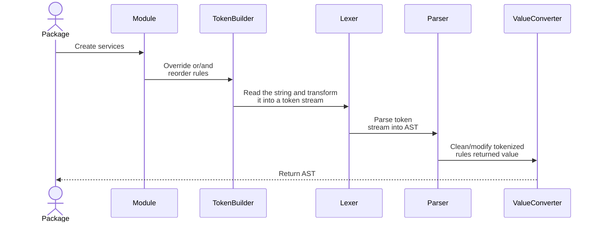

<p align="center">


</p>
<h1 align="center">
Mermaid Parser
</h1>

<p align="center">
Mermaid parser package
<p>

[](https://www.npmjs.com/package/@mermaid-js/parser)

## How the package works

The package exports a `parse` function that has two parameters:

```ts
declare function parse<T extends DiagramAST>(
  diagramType: keyof typeof initializers,
  text: string
): T;
```

## How does a Langium-based parser work?



- When to override `TokenBuilder`?

  - To override keyword rules.
  - To override terminal rules that need a custom function.
  - To manually reorder the list of rules.

- When to override `Lexer`?

  - To modify input before tokenizing.
  - To insert/modify tokens that cannot or have not been parsed.

- When to override `LangiumParser`?

  - To insert or modify attributes that can't be parsed.

- When to override `ValueConverter`?

  - To modify the returned value from the parser.
