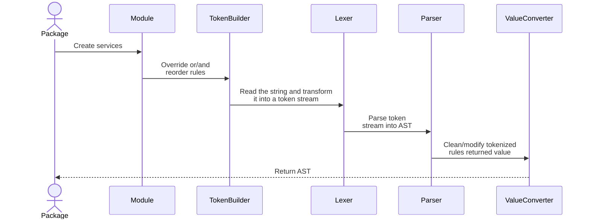

<p align="center">


</p>
<h1 align="center">
Mermaid Parser
</h1>

<p align="center">
Mermaid parser package
<p>

[](https://www.npmjs.com/package/@mermaid-js/parser)

> [!WARNING]
> **Deprecated — do not add new languages here.**
>
> Mermaid is migrating its diagram parsers to [Chevrotain](https://chevrotain.io/), co-located
> with each diagram under `packages/mermaid/src/diagrams/<diagram>/parser/`. This separate,
> Langium-based package is being phased out **one diagram at a time**.
>
> - **No new grammars** should be added here. A new diagram gets a Chevrotain parser next to the
>   diagram instead.
> - **Existing languages stay and remain fully functional** during the transition. Each migrated
>   diagram keeps its Langium parser reachable as an instant rollback via the per-diagram config
>   switch: `parser: { <diagram>: 'legacy' | 'chevrotain' }`.
> - A language is only ever removed from this package as a **future, opt-in cleanup** — after its
>   Chevrotain replacement has shipped, been the trusted default long enough that the rollback is
>   no longer needed. Never during a per-diagram migration.

## How the package works

The package exports a `parse` function that has two parameters:

```ts
declare function parse<T extends DiagramAST>(
  diagramType: keyof typeof initializers,
  text: string
): T;
```

## How does a Langium-based parser work?


```mermaid
sequenceDiagram
actor Package
participant Module
participant TokenBuilder
participant Lexer
participant Parser
participant ValueConverter


Package ->> Module: Create services
Module ->> TokenBuilder: Override or/and<br>reorder rules
TokenBuilder ->> Lexer: Read the string and transform<br>it into a token stream
Lexer ->> Parser: Parse token<br>stream into AST
Parser ->> ValueConverter: Clean/modify tokenized<br>rules returned value
ValueConverter -->> Package: Return AST
```

- When to override `TokenBuilder`?
  - To override keyword rules.
  - To override terminal rules that need a custom function.
  - To manually reorder the list of rules.

- When to override `Lexer`?
  - To modify input before tokenizing.
  - To insert/modify tokens that cannot or have not been parsed.

- When to override `LangiumParser`?
  - To insert or modify attributes that can't be parsed.

- When to override `ValueConverter`?
  - To modify the returned value from the parser.
