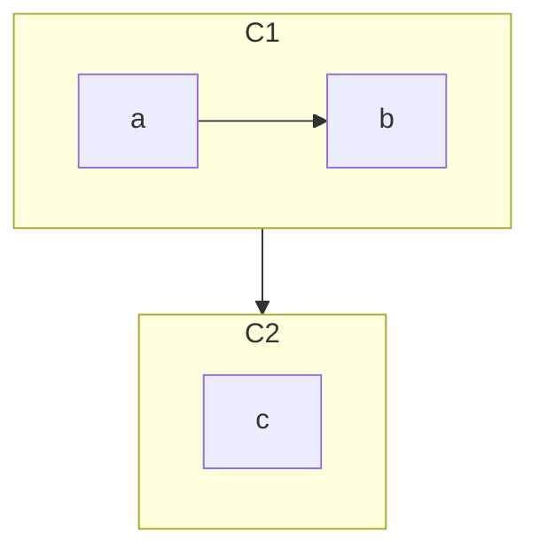
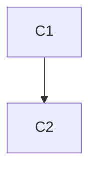
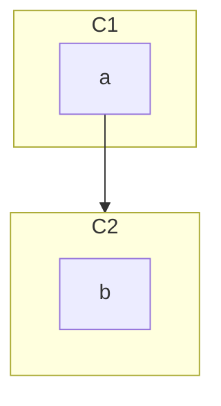

# Cluster handling

Dagre does not support edges between nodes and clusters or between clusters to other clusters. In order to remedy this shortcoming the dagre wrapper implements a few work-arounds.

In the diagram below there are two clusters and there are no edges to nodes outside the own cluster.



In this case the dagre-wrapper will transform the graph to the graph below.


The new nodes C1 and C2 are a special type of nodes, clusterNodes. ClusterNodes have have the nodes in the cluster including the cluster attached in a graph object.

When rendering this diagram it it beeing rendered recursively. The diagram is rendered by the dagre-mermaid:render function which in turn will be used to render the node C1 and the node C2. The result of those renderings will be inserted as nodes in the "root" diagram. With this recursive approach it would be possible to have different layout direction for each cluster.

```
{ clusterNode: true, graph }
```
*Data for a clusterNode*

When a cluster has edges to or from some of its nodes leading outside the cluster the approach of recursive rendering can not be used as the layout of the graph needs to take responsibility for nodes outside of the cluster.



To handle this case a special type of edge is inserted. The edge to/from the cluster is replaced with an edge to/from a node in the cluster which is tagged with toCluster/fromCluster. When rendering this edge the intersection between the edge and the border of the cluster is calculated making the edge start/stop there. In practice this renders like an an edge to/from the cluster.

In the diagram above the root diagram would be rendered with C1 whereas C2 would be rendered recursively.

Of these two approaches the top one renders better and is used when possible. When this is not possible, ie an edge is added crossing the border the non recursive approach is used.


# Graph objects and their properties

Explains the representation of various objects used to render the flow charts and what the properties mean. This ofc from the perspective of the dagre-wrapper.

## node

Sample object:
```json
{
  "shape":"rect",
  "labelText":"Test",
  "rx":0,
  "ry":0,
  "class":"default",
  "style":"",
  "id":"Test",
  "type":"group",
  "padding":15}
```

This is set by the renderer of the diagram and insert the data that the wrapper neds for rendering.

|  property  |                                                 description                                                 |
| ---------- | ----------------------------------------------------------------------------------------------------------- |
| labelStyle | Css styles for the label. User for instance for styling the labels for clusters                            |
| shape      | The shape of the node.                                                                                      |
| labelText  | The text on the label                                                                                       |
| rx         | The corner radius - maybe part of the shape instead? Used for rects.                                        |
| ry         | The corner radius - maybe part of the shape instead? Used for rects.                                        |
| classes    | Classes to be set for the shape. Not used                                                                   |
| style      | Css styles for the actual shape                                                                             |
| id         | id of the shape                                                                                             |
| type       | if set to group then this node indicates *a cluster*.                                                       |
| padding    | Padding. Passed from the render as this might differ between different diagrams. Maybe obsolete.            |
| data       | Non-generic data specific to the shape.                                                                     |


# edge

arrowType sets the type of arrows to use. The following arrow types are currently supported:

arrow_cross
double_arrow_cross
arrow_point
double_arrow_point
arrow_circle
double_arrow_circle

Lets try to make these types semantic free so that diagram type semantics does not find its way in to this more generic layer.


Required edgeData for proper rendering:

|  property  |               description                |
| ---------- | ---------------------------------------- |
| id         | Id of the edge                           |
| arrowHead  | overlap between arrowHead and arrowType? |
| arrowType  | overlap between arrowHead and arrowType? |
| style      |                                          |
| labelStyle |                                          |
| label      | overlap between label and labelText?     |
| labelPos   |                                          |
| labelType  | overlap between label and labelText?     |
| thickness  | Sets the thinkess of the edge. Can be \['normal', 'thick'\] |
| pattern    | Sets the pattern of the edge. Can be \['solid', 'dotted', 'dashed'\]    |


# Markers

Define what markers that should be included in the diagram with the insert markers function. The function takes two arguments, first the element in which the markers should be included and a list of the markers that should be added.

Ex:
insertMarkers(el, \['point', 'circle'\])

The example above adds the markers point and cross. This means that edges with the arrowTypes arrow_cross, double_arrow_cross, arrow_point and double_arrow_cross will get the corresponding markers but arrowType arrow_cross will have no impact.

Current markers:
* point - the standard arrow from flowcharts
* circle - Arrows ending with circle
* cross - arrows starting and ending with a cross


// Todo - in case of common renderer
# Common functions used by the renderer to be implemented by the Db

getDirection
getClasses
