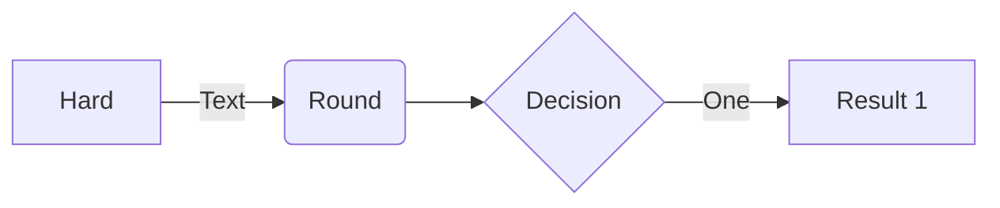
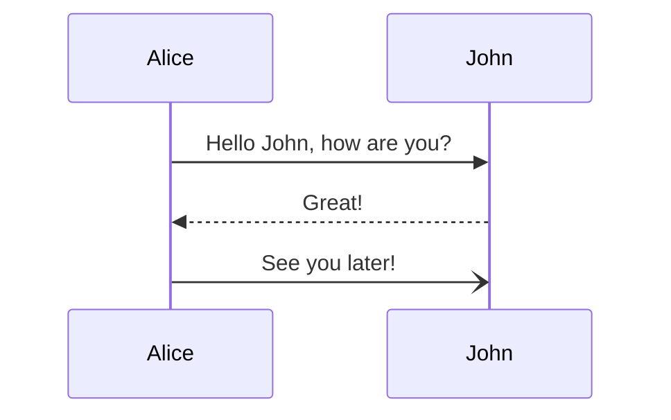
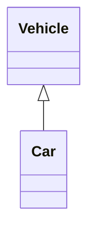
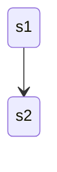
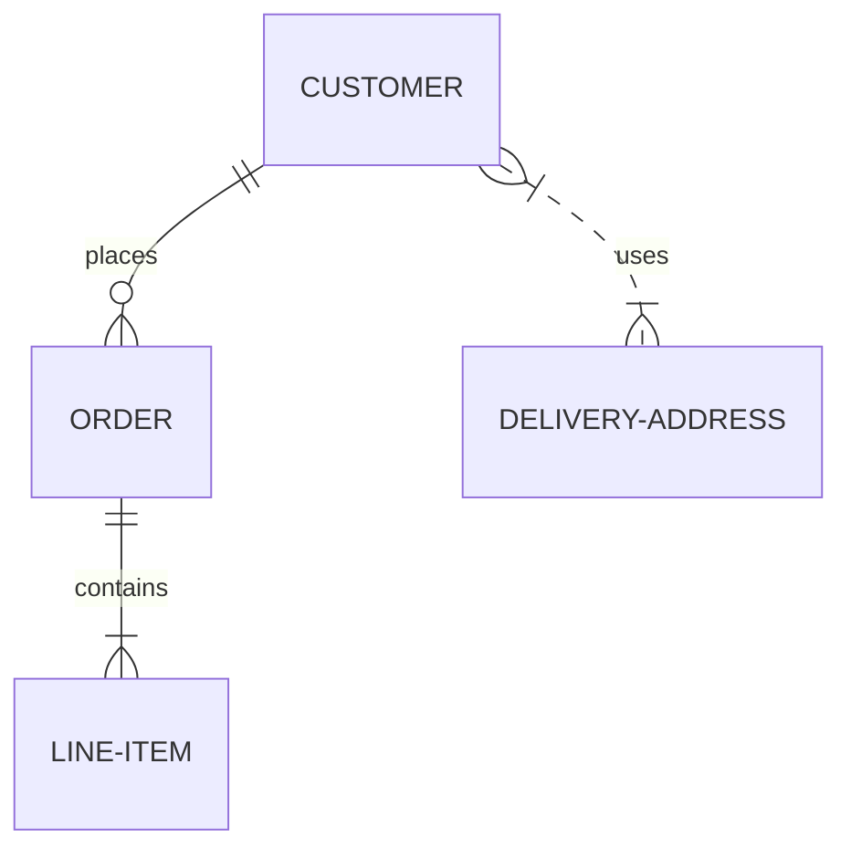
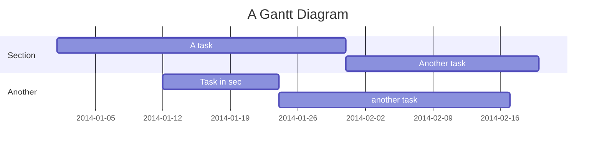
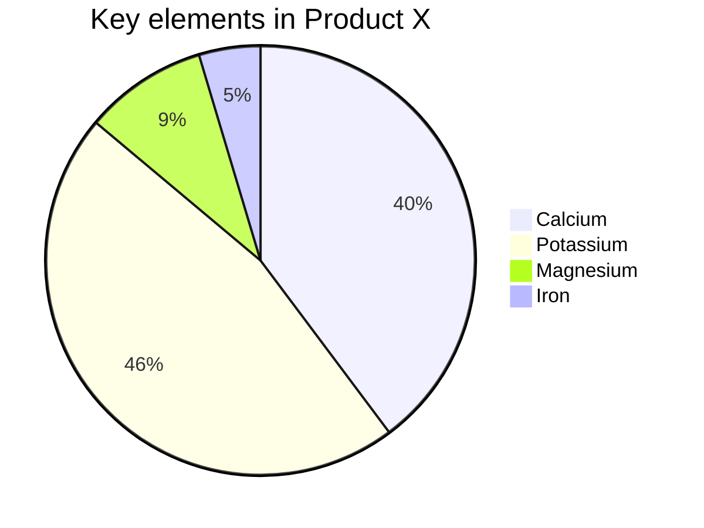

# Accessibility Options

**Edit this Page** [](https://github.com/mermaid-js/mermaid/blob/develop/docs/accessibility.md)

## Accessibility
Now with Mermaid library in much wider use, we have started to work towards more accessible features, based on the feedback from the community.

To begin with, we have added a new feature to Mermaid library, which is to support accessibility options, **Accessibility Title** and **Accessibility Description**.

This support for accessibility options is available for all the diagrams/chart types. Also, we have tired to keep the same format for the accessibility options, so that it is easy to understand and maintain.


## Defining Accessibility Options

### Single line accessibility values
The diagram authors can now add the accessibility options in the diagram definition, using the `accTitle` and `accDescr` keywords, where each keyword is followed by `:` and the string value for title and description like:
-  `accTitle: "Your Accessibility Title"` or
-  `accDescr: "Your Accessibility Description"`

**When these two options are defined, they will  add a coressponding  `<title>` and `<desc>` tag in the SVG.**

Let us take a look at the following example with a flowchart diagram:


See in the code snippet above, the `accTitle` and `accDescr` are defined in the diagram definition. They result in the following tags in SVG code:


### Multi-line Accessibility title/description
You can also define the accessibility options in a multi-line format, where the keyword is followed by opening curly bracket `{` and then mutltile lines, followed by a closing `}`.

`accTitle: My single line title value` (***single line format***)

vs

`accDescr: {
  My multi-line description
  of the diagram
}` (***multi-line format***)

Let us look at it in the following example, with same flowchart:

See in the code snippet above, the `accTitle` and `accDescr` are defined in the diagram definition. They result in the following tags in SVG code:


### Sample Code Snippet for other diagram types

#### Sequence Diagram



#### Class Diagram



#### State Diagram



#### Entity Relationship Diagram



#### User Journey Diagram

  ```mermaid-example
    journey
        accTitle: My User Journey Diagram
        accDescr: My User Journey Diagram Description

        title My working day
        section Go to work
          Make tea: 5: Me
          Go upstairs: 3: Me
          Do work: 1: Me, Cat
        section Go home
          Go downstairs: 5: Me
          Sit down: 5: Me

  ```

#### Gantt Chart



#### Pie Chart


#### Requirement Diagram

  ```mermaid-example
    requirementDiagram
        accTitle: My Requirement Diagram
        accDescr: My Requirement Diagram Description

         requirement test_req {
    id: 1
    text: the test text.
    risk: high
    verifymethod: test
    }

    element test_entity {
    type: simulation
    }

    test_entity - satisfies -> test_req

  ```

#### Gitgraph

  ```mermaid-example
    gitGraph
        accTitle: My Gitgraph Accessibility Title
        accDescr: My Gitgraph Accessibility Description

       commit
       commit
       branch develop
       checkout develop
       commit
       commit
       checkout main
       merge develop
       commit
       commit

  ```


