# Flowcharts - Basic Syntax

## Graph

This statement declares the direction of the flowchart, either from top to bottom (`TD` or `TB`):

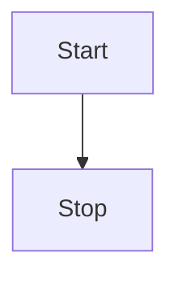

or left to right (`LR`):

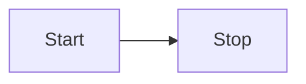

## Flowchart Orientation

Possible FlowChart orientations are:

- TB - top to bottom
- TD - top-down (same as top to bottom)
- BT - bottom to top
- RL - right to left
- LR - left to right

## Flowcharts

This renders a flowchart that allows for features such as: more arrow types, multi directional arrows, and linking to and from subgraphs.

Apart from the graph type, the syntax is the same. This is currently experimental. When the beta period is over, both the graph and flowchart keywords will render in this new way. At this point it is OK to start beta testing flowcharts.

> **Important note** Do not type the word "end" as a Flowchart node. Capitalize all or any one the letters to keep the flowchart from breaking, i.e, "End" or "END". Or you can apply this [workaround](https://github.com/mermaid-js/mermaid/issues/1444#issuecomment-639528897).\*\*

## Nodes and shapes

### A node (default)

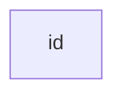

> **Note** The id is what is displayed in the box.

### A node with text

It is also possible to set text in the box that differs from the id. If this is done several times, only the last text
found for the node will be rendered. Also if you define edges for the node later on, you can omit text definitions. The
text previously defined will be used when rendering the box.

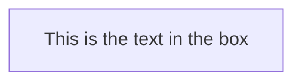

## Node Shapes

### A node with round edges

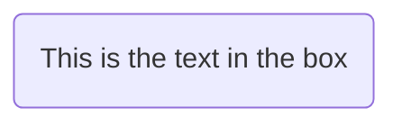

### A stadium-shaped node

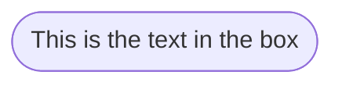

### A node in a subroutine shape

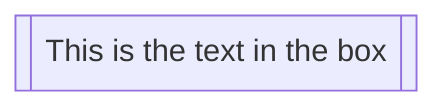

### A node in a cylindrical shape

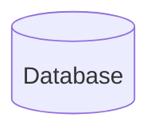

### A node in the form of a circle

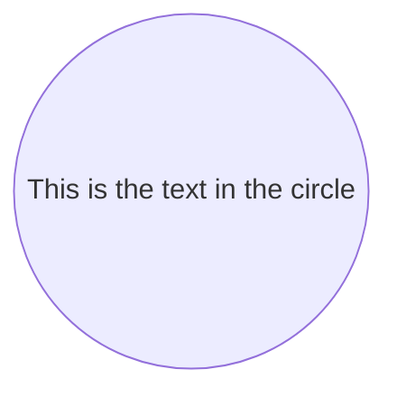

### A node in an asymmetric shape

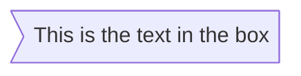

Currently it is only possible to render the shape above, and not its mirror. _This might change with future releases._

### A node (rhombus)

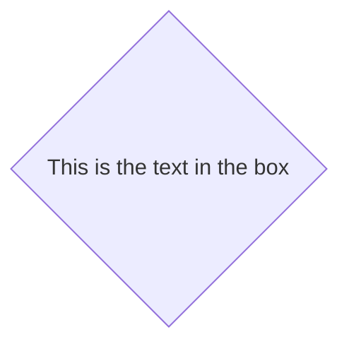

### A hexagonal node

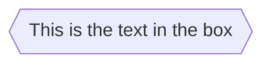

### Parallelogram

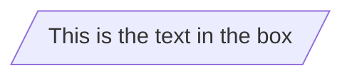

### Parallelogram alt

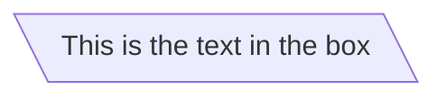

### Trapezoid

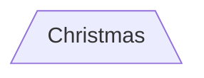

### Trapezoid alt

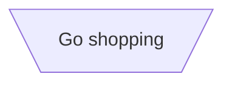

## Links between nodes

Nodes can be connected with links/edges. It is possible to have different types of links, or attach a text string on a link.

### Link with arrow head

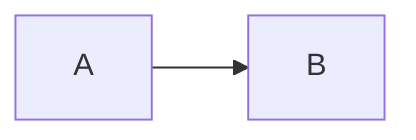

### Open link

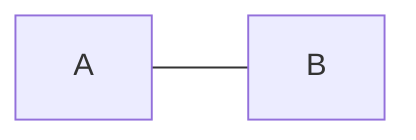

### Text on links

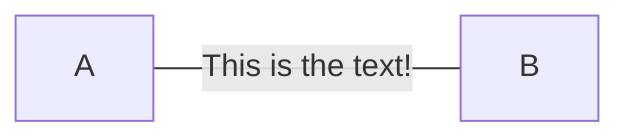

or

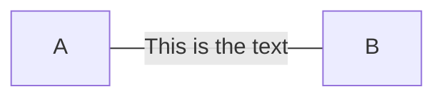

### Link with arrow head and text

```mermaid-example
graph LR
    A-->|text|B
```

or

```mermaid-example
graph LR
    A-- text -->B
```

### Dotted link

```mermaid-example
graph LR;
   A-.->B;
```

### Dotted link with text

```mermaid-example
graph LR
   A-. text .-> B
```

### Thick link

```mermaid-example
graph LR
   A ==> B
```

### Thick link with text

```mermaid-example
graph LR
   A == text ==> B
```

### Chaining of links

It is possible to declare many links on the same line as per below:

```mermaid-example
graph LR
   A -- text --> B -- text2 --> C
```

It is also possible to declare multiple nodes links in the same line as per below:

```mermaid-example
graph LR
   a --> b & c--> d
```

You can then describe dependencies in a very expressive way. Like the one-liner below:

```mermaid-example
graph TB
    A & B--> C & D
```

If you describe the same diagram using the the basic syntax, it will take four lines:

```mmd
graph TB
    A --> C
    A --> D
    B --> C
    B --> D
```

A word of warning, one could go overboard with this, making the graph harder to read in
markdown form. The Swedish word `lagom` comes to mind. It means, not too much and not too little.
This goes for expressive syntaxes as well.

### New arrow types

When using flowchart instead of graph there are new types of arrows supported as per below:

```mermaid-example
flowchart LR
    A --o B
    B --x C
```

### Multi directional arrows

When using flowchart instead of graph there is the possibility to use multidirectional arrows.

```mermaid-example
flowchart LR
    A o--o B
    B <--> C
    C x--x D
```

### Minimum length of a link

Each node in the flowchart is ultimately assigned to a rank in the rendered
graph, i.e. to a vertical or horizontal level (depending on the flowchart
orientation), based on the nodes to which it is linked. By default, links
can span any number of ranks, but you can ask for any link to be longer
than the others by adding extra dashes in the link definition.

In the following example, two extra dashes are added in the link from node _B_
to node _E_, so that it spans two more ranks than regular links:

```mermaid-example
graph TD
    A[Start] --> B{Is it?};
    B -->|Yes| C[OK];
    C --> D[Rethink];
    D --> B;
    B ---->|No| E[End];
```

> **Note** The rendering engine may cause some links to be longer than
> the number of ranks requested in order to accommodate the overall topology.

When the link label is written in the middle of the link, the extra dashes must
be added on the right side of the link. The following example is equivalent to
the previous one:

```mermaid-example
graph TD
    A[Start] --> B{Is it?};
    B -- Yes --> C[OK];
    C --> D[Rethink];
    D --> B;
    B -- No ----> E[End];
```

For dotted or thick links, the characters to add are equals signs or dots,
as summed up in the following table:

| Length            |   1    |    2    |    3     |
| ----------------- | :----: | :-----: | :------: |
| Normal            | `---`  | `----`  | `-----`  |
| Normal with arrow | `-->`  | `--->`  | `---->`  |
| Thick             | `===`  | `====`  | `=====`  |
| Thick with arrow  | `==>`  | `===>`  | `====>`  |
| Dotted            | `-.-`  | `-..-`  | `-...-`  |
| Dotted with arrow | `-.->` | `-..->` | `-...->` |

## Special characters that break syntax

Use quotes around text in order to render more troublesome characters, as in the example below:

```mermaid-example
graph LR
    id1["This is the (text) in the box"]
```

### Entity codes to escape characters

Special characters (including Unicode) can be included by using HTML escaping syntax:

```mermaid-example
    graph LR
        A["A double quote:#quot;"] -->B["A dec char:#9829;"]
```

## Subgraphs

```
subgraph title
    graph definition
end
```

An example:

```mermaid-example
graph TB
    c1-->a2
    subgraph one
    a1-->a2
    end
    subgraph two
    b1-->b2
    end
    subgraph three
    c1-->c2
    end
```

You can also set an explicit id for the subgraph:

```mermaid-example
graph TB
    c1-->a2
    subgraph ide1 [one]
    a1-->a2
    end
```

## Flowcharts

With the graphtype `flowchart` it is also possible to set edges to and from subgraphs:

```mermaid-example
flowchart TB
    c1-->a2
    subgraph one
    a1-->a2
    end
    subgraph two
    b1-->b2
    end
    subgraph three
    c1-->c2
    end
    one --> two
    three --> two
    two --> c2
```

## Interaction

A node can have click events bound that lead to either a JavaScript callback or to open a new browser tab. **Note**: This functionality is disabled when using `securityLevel='strict'` and enabled when using `securityLevel='loose'`.

```
click nodeId callback
click nodeId call callback()
```

- nodeId is the id of the node
- `callback` is the name of a JavaScript function defined on the page displaying the graph. The function will be called with the nodeId as an incoming parameter.

```html
<script>
  var callback = function (nodeId) {
    alert('A callback was triggered on ' + nodeId);
  };
</script>
```

Examples of tooltip usage:

The tooltip text is surrounded in double quotes. The styles of the tooltip are set by the class .mermaidTooltip.

```mermaid-example
graph LR;
    A-->B;
    B-->C;
    C-->D;
    click A callback "Tooltip for a callback"
    click B "https://www.github.com" "This is a tooltip for a link"
    click A call callback() "Tooltip for a callback"
    click B href "https://www.github.com" "This is a tooltip for a link"
```

> **Success** The tooltip functionality and the ability to link to urls are available from version 0.5.2.

?> Due to limitations with how Docsify handles JavaScript callback functions, an alternate working demo for the above code can be viewed at [this jsfiddle](https://jsfiddle.net/s37cjoau/3/).

Links are opened in the same browser tab/window by default. It is possible to change this by adding a link target to the click definition (`_self`, `_blank`, `_parent` and `_top` are supported):

```mermaid-example
graph LR;
    A-->B;
    B-->C;
    C-->D;
    D-->E;
    click A "https://www.github.com" _blank
    click B "https://www.github.com" "Open this in a new tab" _blank
    click C href "https://www.github.com" _blank
    click D href "https://www.github.com" "Open this in a new tab" _blank
```

Beginner's tip—here's a full example of using interactive links in HTML:

```html
<body>
  <div class="mermaid">
    graph LR; A-->B; B-->C; C-->D; click A callback "Tooltip" click B "https://www.github.com" "This
    is a link" click C call callback() "Tooltip" click D href "https://www.github.com" "This is a
    link"
  </div>

  <script>
    var callback = function () {
      alert('A callback was triggered');
    };
    var config = {
      startOnLoad: true,
      flowchart: {
        useMaxWidth: true,
        htmlLabels: true,
        curve: 'cardinal',
      },
      securityLevel: 'loose',
    };
    mermaid.initialize(config);
  </script>
</body>
```

### Comments

Comments can be entered within a flow diagram, which will be ignored by the parser. Comments need to be on their own line, and must be prefaced with `%%` (double percent signs). Any text until the next newline will be treated as a comment, including all punctuation and any flow syntax.

```mmd
graph LR
%% this is a comment A -- text --> B{node}
   A -- text --> B -- text2 --> C
```

## Styling and classes

### Styling links

It is possible to style links. For instance, you might want to style a link that is going backwards in the flow. As links
have no ids in the same way as nodes, some other way of attaching style is required.
So instead of ids, the order number of when the link was defined in the graph is used, starting with zero. Here's a linkStyle statement that would apply style to the fourth link in the graph:

```
linkStyle 3 stroke:#ff3,stroke-width:4px,color:red;
```

You can specify a `default` to apply to all links, or you can give a comma-separated list of link order numbers.

Instead of giving a styles option, you can also use custom d3 curve types with the following syntax:

```
linkStyle default|numList|num interpolate curveType
```

If you want to add both D3 and style options, instead of writing:

```
linkStyle default interpolate cardinal
linkStyle default stroke:#ff3,stroke-width:4px,color:red;
```

You can combine them:

```
linkStyle default interpolate cardinal stroke:#ff3,stroke-width:4px,color:red;
```

### Styling a node

It is possible to apply specific styles such as a thicker border or a different background color to a node.

```mermaid-example
graph LR
    id1(Start)-->id2(Stop)
    style id1 fill:#f9f,stroke:#333,stroke-width:4px
    style id2 fill:#bbf,stroke:#f66,stroke-width:2px,color:#fff,stroke-dasharray: 5 5
```

#### Classes

More convenient than defining the style every time is to define a class of styles and attach this class reference to multiple nodes.

here's a class definition:

```
    classDef className fill:#f9f,stroke:#333,stroke-width:4px;
```

and then attaching this class to a node is simply:

```
    class nodeId1 className;
```

It is also possible to attach a class to multiple nodes in one statement:

```
    class nodeId1,nodeId2 className;
```

An even shorter form of adding a class is to attach the classname to the node using the `:::`operator:

```mermaid-example
graph LR
    A:::someclass --> B
    classDef someclass fill:#f96;
```

### Css classes

It is also possible to predefine classes in css styles that can be applied from the graph definition:

**Example style**

```css
.cssClass > rect {
  fill: #ff0000;
  stroke: #ffff00;
  stroke-width: 4px;
}
```

**Example definition**

```mermaid-example
graph LR;
    A-->B[AAA<span>BBB</span>];
    B-->D;
    class A cssClass;
```

### Default class

If a class is named `default` it will be assigned to all nodes that do not have a specific class definition.

```
    classDef default fill:#f9f,stroke:#333,stroke-width:4px;
```

## Basic support for fontawesome

It is possible to add icons from fontawesome. These are accessed via the syntax fa:#icon-class-name#.

```mermaid-example
graph TD
    B["fa:fa-twitter for peace"]
    B-->C[fa:fa-ban forbidden]
    B-->D(fa:fa-spinner);
    B-->E(A fa:fa-camera-retro perhaps?);
```

## Graph declarations with spaces between vertices and link and without semicolon

- After release 0.2.16, graph declaration statements do not need to end with a semicolon. (And they can continue to have the ending semicolon—it has now just become optional.) So the below graph declaration is valid along with the old declarations.

- A single space is allowed between vertices and the link, however there should not be any space between a vertex and its text, or a link and its text. The old syntax of graph declarations will also work, so this new feature is optional and is introduced to improve readability.

Below is an example of the new way to declare graph edges. This is valid alongside any old-style declarations of graph edges.

```mermaid-example
graph LR
    A[Hard edge] -->|Link text| B(Round edge)
    B --> C{Decision}
    C -->|One| D[Result one]
    C -->|Two| E[Result two]
```

## Configuration...

Is it possible to adjust the width of the rendered flowchart.

This is done by defining **mermaid.flowchartConfig**, or by the CLI to use a json file with the configuration (which is described in the mermaidCLI page).
In Javascript config parameters can be set by using `mermaid.flowchartConfig`:

```javascript
mermaid.flowchartConfig = {
  width: '100%',
};
```
